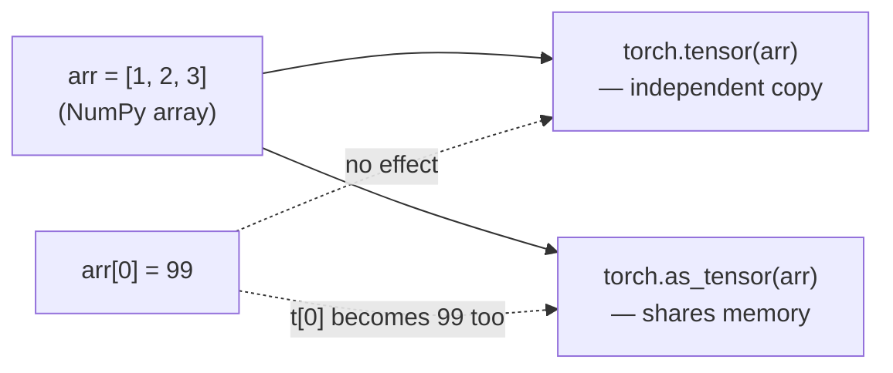
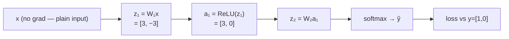

# Part 2 — PyTorch (draft)

> **Status:** markdown draft, pre-HTML. New page — v2 currently has no PyTorch part at all. Source lineage: v1 `part-4-pytorch.html`, **substantially reframed**: v1 placed this page *after* its from-scratch NumPy build ("what Part 2's 60 lines cost you") and referenced that build throughout. In this course's order, PyTorch comes **before** Neural Network (Part 3) — so every backward-looking reference below has been flipped to a forward pointer ("Part 3 builds this by hand; here's the tool version first"), and the one worked example that literally reused Part 2(old)'s numbers has been replaced with a self-contained equivalent.
>
> **Diagram note:** mermaid blocks stand in for interactive widgets to build in the HTML pass.
>
> **Written for a genuine beginner.** This part assumes Part 1's tools (dot product, matrix, derivative, chain rule, gradient) but **not** Part 3 yet — you have not built a network by hand at this point in the course. That's deliberate: this page shows you the practical tool a working engineer actually reaches for, so that when Part 3 immediately afterward builds the identical thing from raw arithmetic, you already know what shape you're aiming for and can feel exactly how much the framework is doing for you.

---

## 01 · Why a framework, at all

### What a from-scratch backward pass costs you

Part 1 derives, by hand, every calculus fact a neural network needs: the derivative, the chain rule, the gradient. Part 3 goes one step further and writes out a full network's **backward pass** — the actual arithmetic that turns "the loss was too high" into "here's exactly how to adjust each of 100,000+ numbers" — using nothing but those hand-derived formulas.

That's necessary once: you cannot trust a mechanism you've never opened, and Part 3 opens it completely. It is also **not something you want to repeat by hand every time**. Swap ReLU for GELU, add a residual connection, add attention — and every formula has to be re-derived and the backward pass rewritten, correctly, from scratch, every single time.

**That's the entire pitch for a framework.** PyTorch's one job is to remember how a number was produced, so it can undo that recipe with the chain rule automatically — the same chain rule Part 1 built, just applied by software instead of by hand.

> This is not a new idea replacing the old one. It is the old one, automated. You still write the *forward* pass — the recipe — in plain code. You never write `backward()` yourself.

---

## 02 · The data structure

### A tensor is a NumPy array with a memory

A `torch.Tensor` holds numbers exactly like a NumPy array — same shape, same dtype concept, and on the CPU they even **share the same underlying memory layout**, which is why converting between them is free. The difference: a tensor can additionally run on a GPU, and — the part that matters here — it can **record the operations performed on it**, which a plain array never does. NumPy has no concept of "how was this number computed"; a tensor does, when asked to.

| Attribute | What it tells you | Default |
|---|---|---|
| `.shape` | Dimensions, same convention as NumPy | — |
| `.dtype` | Numeric type of every element | `float32` |
| `.device` | Where it physically lives | `cpu` |
| `.requires_grad` | Whether operations on it get recorded | `False` |

**Predict first — does mutating the original array change the tensor?** Two ways to build a tensor from an existing NumPy array look almost interchangeable: `torch.tensor(arr)` **copies** the data; `torch.as_tensor(arr)` (and `torch.from_numpy(arr)`) **share** the same memory. If you mutate `arr` after creating each one, which tensor changes with it?


> **Widget claim to check:** mutating `arr` after construction changes the `as_tensor`/`from_numpy` view but leaves the `tensor()` copy untouched (already built as `tenfig` — port/keep). This is a real bug source: a pipeline that assumes a copy, given a view, will see values change underneath it later in the script.

---

## 03 · The core mechanism

### Autograd: replaying the recipe backwards

Set `requires_grad=True` on a tensor and every operation performed on it from that point gets silently recorded into a graph — not executed differently, just *logged*. Ordinary input data never needs this (there's nothing to learn about a pixel value), which is why it defaults to `False`; weights and biases need it, because they're exactly the numbers you intend to update.

Calling `.backward()` on a final scalar (the loss) walks that recorded graph in reverse, applies the chain rule at every step — precisely the way Part 1 built it, and the way Part 3 will do explicitly, by hand, for a full network — and deposits the result in each tracked tensor's `.grad`.

**A small worked example.** `x = [1, 2]` (plain input, no gradient needed), a first layer `W₁` (2×2) with a ReLU, a second layer `W₂` (2×2), target class `y = [1, 0]`. `W₁`'s two rows give pre-activations `z₁ = [3, −3]` — the second hidden unit is negative, so ReLU zeroes it: `a₁ = [3, 0]`.


> **Widget claim to check:** press Forward to build this exact graph, then Backward to walk it in reverse — `x` never gets a `.grad` at all (it has `requires_grad=False` by default, and nothing would read it even if it did), and `W₁`'s second row — the row feeding the hidden unit ReLU switched off — comes back as **exactly zero**, the whole row, because that unit contributed nothing on the forward pass and so can carry no blame backward (already built as `agfig`, adapted from this self-contained example — port/adapt).

> **Trap: reading `.grad` before calling `.backward()`.** A tensor's `.grad` is `None` until `.backward()` has actually run — not zero, `None`. Forgetting this produces a confusing `NoneType` error a step away from where the real mistake is (usually: the forward pass hasn't been called yet, or the tensor never had `requires_grad=True` in the first place).

---

## 04 · Defining a model

### `nn.Module`: architecture as a class

Every PyTorch model subclasses `nn.Module`. Layers get declared in `__init__`; how data flows through them is written once, in a method literally called `forward`. Calling `model(x)` runs `forward` automatically — that's a plain Python mechanism (`__call__`), not framework magic.

| Term used here | Also called |
|---|---|
| `nn.Linear` | Fully connected layer · Dense layer (Keras) · hidden layer |

**A preview of what Part 3 builds by hand.** Below is a `784 → 128 → 64 → 10` network — the architecture Part 3 derives from raw arithmetic, one weight matrix and one nonlinearity at a time. Seeing the finished shape here first, as five lines of working code, gives you a target to aim for once Part 3 starts deriving *why* each of those lines has to be there.

```python
import torch.nn as nn
import torch.nn.functional as F

class MLP(nn.Module):
    def __init__(self):
        super().__init__()
        self.l1 = nn.Linear(784, 128)
        self.l2 = nn.Linear(128, 64)
        self.l3 = nn.Linear(64, 10)

    def forward(self, x):
        x = F.relu(self.l1(x))
        x = F.relu(self.l2(x))
        return self.l3(x)   # logits — softmax lives in the loss, not here
```

Two things worth noticing, not glossing over. First, each layer's input width has to be stated explicitly — PyTorch infers nothing about width from context; you still design the shape ladder yourself, the same shape ladder Part 3 §04 derives the rule for. Second, this returns raw **logits**, not probabilities: `nn.CrossEntropyLoss` applies softmax internally, so applying it yourself first and passing the result in is a real, common, and silent bug.

---

## 05 · Fitting it

### The training loop, translated

Whatever the architecture, training is always the same five-step pattern — Part 3 spells out *forward → loss → backward → update, repeat* in full arithmetic; PyTorch just gives each step one call:

```python
pred = model(X)              # forward — one pass through every layer
loss = criterion(pred, y)    # loss — compare against the true labels
loss.backward()              # backward — autograd fills in every .grad
optimizer.step()             # update — each parameter moves against its gradient
optimizer.zero_grad()        # reset — clear .grad before the next batch
```

> **Trap: the last call is the one people forget.** `.backward()` **adds** new gradients onto whatever is already sitting in `.grad` — it does not overwrite. Skip `zero_grad()` and every batch's gradient piles on top of the last one, silently; training still runs, the loss curve just never makes sense. This isn't a bug you're protecting against — it's the mechanism *gradient accumulation* (a real, occasionally useful technique for simulating a larger batch size on limited memory) deliberately exploits. The default assumption in an ordinary loop is that you don't want that, so `optimizer.zero_grad()` runs every single step, without exception.

---

## 06 · Full example

### An MNIST classifier, in PyTorch

Everything above, assembled — a complete, runnable classifier. Same architecture, same ≈109,386 parameters, Part 3 will build by hand once it derives why this exact shape ladder is the right one.

```python
import torch
import torch.nn as nn
import torch.nn.functional as F

class MLP(nn.Module):
    def __init__(self):
        super().__init__()
        self.l1 = nn.Linear(784, 128)
        self.l2 = nn.Linear(128, 64)
        self.l3 = nn.Linear(64, 10)

    def forward(self, x):
        x = F.relu(self.l1(x))
        x = F.relu(self.l2(x))
        return self.l3(x)          # logits — CrossEntropyLoss softmaxes internally

device = torch.accelerator.current_accelerator() if torch.accelerator.is_available() else "cpu"
model = MLP().to(device)
criterion = nn.CrossEntropyLoss()
optimizer = torch.optim.SGD(model.parameters(), lr=0.1)

def train_epoch(loader):
    model.train()                              # enables dropout/batchnorm training behaviour
    for X, y in loader:
        X, y = X.to(device), y.to(device)      # PyTorch never moves data for you
        pred = model(X)                        # forward
        loss = criterion(pred, y)              # loss
        loss.backward()                        # backward — autograd walks the graph
        optimizer.step()                       # update every parameter
        optimizer.zero_grad()                  # clear .grad before the next batch

def evaluate(loader):
    model.eval()                               # disables dropout/batchnorm training behaviour
    correct = total = 0
    with torch.no_grad():                      # no graph needed — pure forward pass
        for X, y in loader:
            X, y = X.to(device), y.to(device)
            pred = model(X).argmax(dim=1)      # highest-scoring class, unrelated to autograd
            correct += (pred == y).sum().item()
            total += y.size(0)
    return correct / total
```

### Where each idea will land, once Part 3 builds it by hand

| Concept | Here, PyTorch | Part 3, NumPy (forward pointer) |
|---|---|---|
| Layer = matrix multiply | `nn.Linear(in, out)` | `A @ W.T + b` |
| Nonlinearity | `F.relu(x)` | `relu(Z)` |
| Softmax + cross-entropy | `nn.CrossEntropyLoss()`, computed for you | hand-derived `delta = (acts[-1]-Y)/B` |
| Backward pass | `loss.backward()` | ~10 lines, following §09's `δ = ŷ − y` and its neighbors |
| Gradient descent | `optimizer.step()` | `W -= lr * dW` |
| He initialization | `nn.Linear`'s default (Kaiming-uniform variant) | explicit `rng.normal(0, sqrt(2/n_in))` |

Nothing in the left column does anything the right column won't also do — the framework's value is entirely that it *generalizes*. The same five calls in §05 train a 3-layer MLP, a CNN, or the 96-block transformer behind a modern LLM, unchanged.

---

## 07 · Practicalities

### Device placement, and saving what you trained

**Device.** PyTorch never moves anything for you. Detect what's available once, at the top of a script, then explicitly call `.to(device)` on both the model and every batch of data.

> **Trap: a missing GPU fails silently.** If no accelerator is attached, PyTorch does not error — it quietly runs everything on CPU, correctly but far slower, and gives no warning. Print the device you're actually using at the start of every script rather than assuming.

**Train vs. eval mode.** `model.train()` and `model.eval()` switch layers like Dropout and BatchNorm between their training and inference behavior — Dropout does nothing at eval time; BatchNorm switches from batch statistics to a running average. `torch.no_grad()` is a separate, complementary decision: it skips building the autograd graph entirely, because a forward pass alone never needs one. Use both together at evaluation and inference — one changes layer behavior, the other saves memory and time that would otherwise go toward a backward pass that's never coming.

**Saving.** A model is architecture plus parameters, kept deliberately separate — the weights alone carry no information about what shape of network they belong to.

```python
torch.save(model.state_dict(), "model.pth")          # save just the numbers

# later, in a script that already defines class MLP:
model = MLP()
model.load_state_dict(torch.load("model.pth"))       # re-attach them to a matching architecture
model.eval()
```

> PyTorch confirming "all keys matched successfully" is the sign the load worked — a shape or naming mismatch between the saved file and the freshly-instantiated class is the usual failure mode here.

---

## 08 · Trade-offs

### PyTorch vs. the alternative

Keras/TensorFlow historically favored compiling the whole computation graph upfront; PyTorch builds it step by step as code actually executes — "define-by-run." That single difference explains most of the practical split between the two.

| | PyTorch | Keras / TensorFlow |
|---|---|---|
| Execution | Define-by-run — graph builds as code runs | Historically compile-first |
| Custom logic | Drop any custom function or block straight into a model | Sequential API allows none; Functional API allows some |
| Code volume | More explicit, more verbose | Less code for standard architectures |
| Where it dominates | Research — inventing new architectures needs the control | Historically, production — a roughly two-year head start |

The training loop you just wrote by hand in §05 is exactly the price of that control: Keras collapses it into `model.fit()`. You now know precisely what that one call is hiding.

---

## 09 · Reference: traps and a cheatsheet

| Symptom | Likely cause |
|---|---|
| Shape mismatch on the first batch | Still the single most common error — trace `input_shape → output_shape` through every layer by hand, exactly the shape-table discipline Part 3 §04 builds |
| Loss trends downward, then suddenly looks wrong across epochs | Forgot `optimizer.zero_grad()` — gradients are accumulating, not resetting (§05) |
| `RuntimeError: element 0 requires grad...` during eval | Forgot `torch.no_grad()` — usually harmless, sometimes just wastes memory |
| Eval accuracy looks worse than expected | Forgot `model.eval()` — Dropout is still randomly zeroing units |
| A downstream step sees data change unexpectedly | `as_tensor`/`from_numpy` share memory; `torch.tensor()` copies — see §02 |
| Loss hits exactly 0.0 | Red flag, not a win — almost always a bug or data leak, the same rule Part 3's debugging section applies |
| Training is correct but mysteriously slow | Check `print(device)` — silently running on CPU, see §07 |

---

## 10 · Practice: exercises

1. A tensor `x` was created with `requires_grad=False`, the default. You call `y = x * 2; y.sum().backward()`. What happens, and why?
2. You train for 10 epochs but forget `optimizer.zero_grad()`. Loss decreases at first, then behaves strangely. Explain the mechanism, not just "it's a bug."
3. Why does `nn.Linear(in_features, out_features)` only need `in_features` specified explicitly for the first layer of a stack?
4. You call `model(x)` during evaluation without wrapping it in `torch.no_grad()`. Nothing crashes. What did you waste, and why?
5. `arr = np.array([1,2,3]); t = torch.tensor(arr); arr[0] = 99`. What is `t[0]` now?

<details>
<summary>Answers</summary>

1. Autograd never tracked `x`, so no graph exists for it — but `y` was still produced from a tracked-or-not computation; since nothing upstream requires a gradient, `.backward()` either raises (nothing to differentiate into) or silently gives `x.grad = None`, depending on whether any tensor in the chain had `requires_grad=True`. The fix is always the same: set it explicitly on whatever you intend to update.
2. `.backward()` adds each batch's gradient onto whatever is already in `.grad` rather than replacing it. Gradients grow across batches within an epoch, so the effective step size silently increases as training proceeds — loss trends downward briefly, then destabilizes as the accumulated gradient overshoots.
3. Because every layer after the first automatically receives the previous layer's `out_features` as its own input width — the shape ladder is still something *you* design, PyTorch just refuses to make you repeat a number that's already implied.
4. Compute and memory building an autograd graph that will never be used — every intermediate activation gets retained in case `.backward()` is called on it, which at inference time it never is.
5. `1` — `torch.tensor()` copies, so `t[0]` is unaffected by the later mutation. (If the code had used `torch.as_tensor(arr)` instead, the answer would be `99` — see §02's widget.)

</details>

---

## 11 · Glossary

| Term | Plain-language meaning |
|---|---|
| **Tensor** | A NumPy-array-like object that can additionally track how it was computed |
| **`requires_grad`** | Marks a tensor for gradient tracking; `False` by default |
| **`.grad`** | Where a tracked tensor's gradient is deposited after `.backward()` — `None` until then |
| **Autograd** | PyTorch's system for recording operations and replaying them backward via the chain rule |
| **`.backward()`** | Walks the recorded computation graph in reverse, filling in every tracked tensor's `.grad` |
| **`torch.no_grad()`** | Skips building the autograd graph for a block of code |
| **`nn.Module`** | Base class for a model; separates architecture (`__init__`) from data flow (`forward`) |
| **`nn.Linear`** | A fully-connected / dense layer |
| **Optimizer** | The object that applies gradient descent (`optimizer.step()`) using each parameter's `.grad` |
| **`model.train()` / `.eval()`** | Switches Dropout/BatchNorm behavior, not gradient tracking |
| **Epoch vs. step** | One epoch = the full dataset seen once; each batch processed along the way is one step |
| **`state_dict`** | A model's parameters alone, without its architecture — what `torch.save` actually saves |

---

## 12 · Onward

A tensor is a NumPy array that can additionally track how it was computed. `requires_grad=True` marks what should get a gradient; `.backward()` computes it via the chain rule, automatically. `nn.Module` separates architecture from data flow. The training loop is still forward → loss → backward → update — now five specific calls, always ending in `zero_grad()`.

Everything above is a tool wrapped around ideas Part 1 already built from arithmetic. What's different is *who writes the backward pass*. Part 3 opens that hood completely: the same architecture previewed in §04 and §06 above, derived from nothing but the dot product, the chain rule, and the gradient — and its backward pass written out by hand, in raw NumPy, so you can watch autograd arrive at those exact same numbers for yourself.
