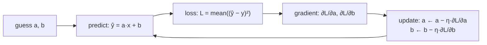
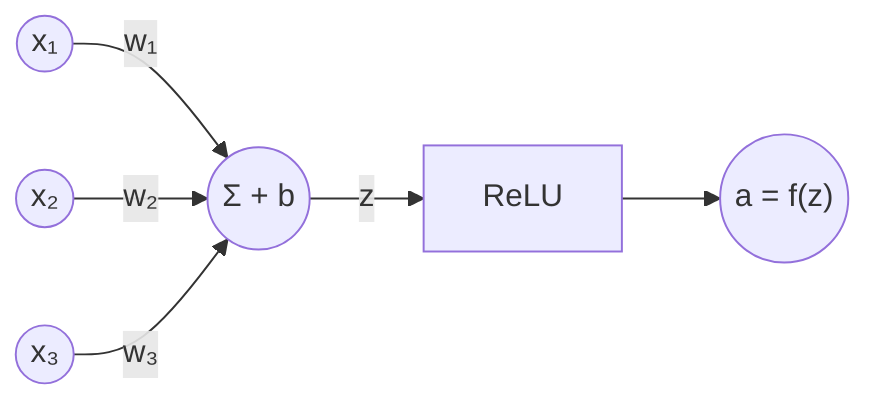
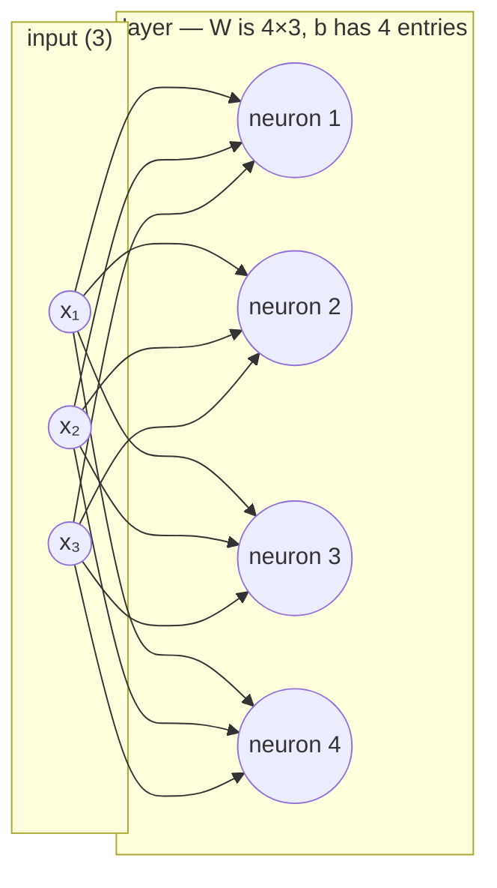
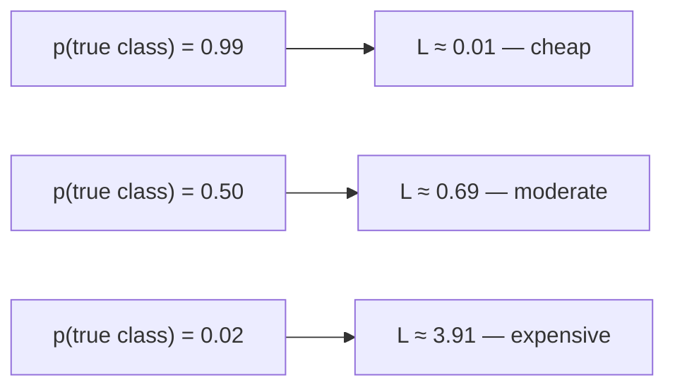
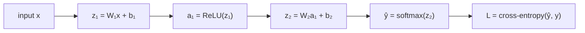
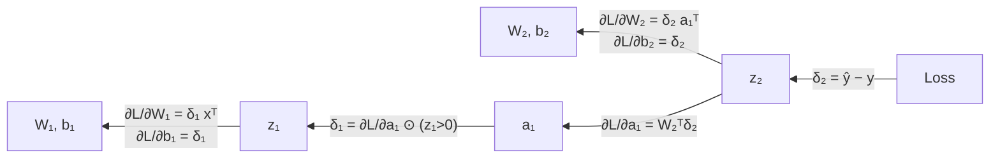
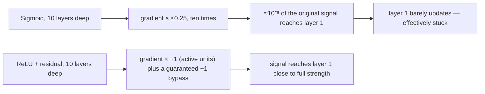
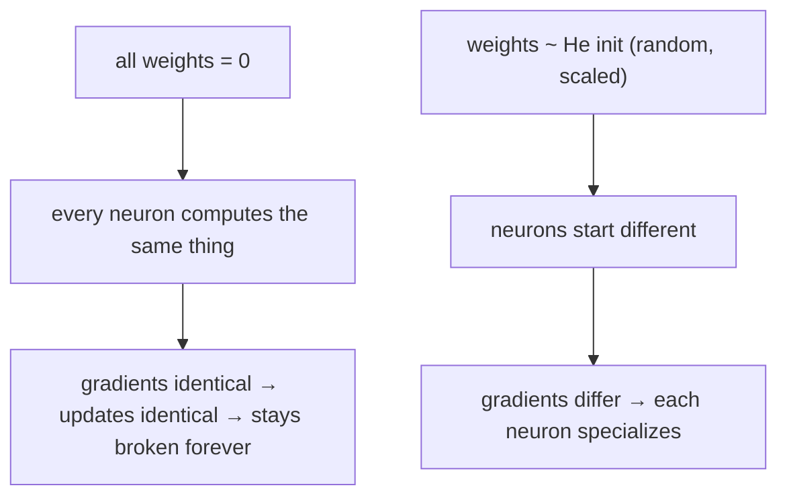
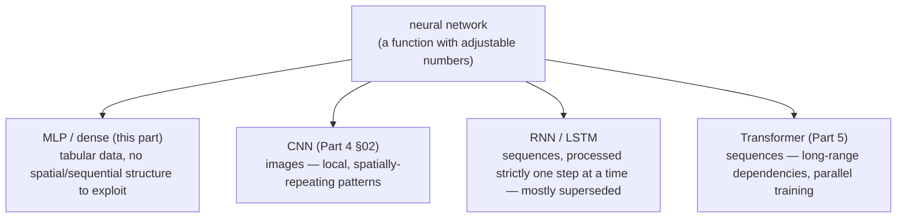

# Part 3 — Neural Network (draft)

> **Status:** markdown draft, pre-HTML. Renumbered from "Part 2" to "Part 3" — Part 2 is now **PyTorch** (see plan: PyTorch moved earlier, previewing the architecture this part then builds from raw arithmetic). Source lineage: v1 `part-2-build.html` (mental model, neuron, layers, backprop, 60-line NumPy model, bugs) + v1 `part-1-maths.html` §5–9 (softmax/cross-entropy derivations, vanishing gradients) + existing v2 `part-1-foundations.html` (dot product, matrix, derivative, chain rule, gradient — all assumed known here) + existing v2 `part-2-neural-network.html` (current live page, being superseded/expanded/renumbered by this draft).
>
> **Diagram note:** mermaid blocks below stand in for what will become an interactive canvas/SVG widget in the HTML pass — each one is marked with the specific claim the eventual widget should let the reader check.
>
> **Written for a genuine beginner.** No calculus or linear algebra is assumed beyond what Part 1 already built from arithmetic. Every mechanism below gets a plain-language mental model *before* its formula — "blame," "a tiny scoring machine," "a default answer before evidence arrives" — because the formula should feel like notation for something you already picture, not the other way around.
>
> **Prerequisites this part assumes (all built in Part 1):** the dot product as "agreement," `Wx + b` as "many questions asked at once," the derivative as "which way, how fast," the chain rule as "rates multiply through a composition," and the gradient as "one partial derivative per input." Part 2 (PyTorch) previewed *what* this part's finished architecture looks like as code; this part derives *why* every line of that code is there, from nothing but arithmetic.

---

## 01 · The mental model

### A neural network is a function you fit to data

Strip away the vocabulary and a neural network is a function: numbers in, numbers out.

| Task | In | Out |
|---|---|---|
| Digit recognition | 784 pixel values | 10 class scores |
| House pricing | 12 property features | 1 price |
| Language modelling | a sequence of tokens | a score per possible next token |

What makes it *neural* is that the function has millions of adjustable numbers inside it, and nobody sets them by hand — an optimization procedure finds them by looking at examples.

So there are only ever two questions: **what shape is the function**, and **how do we fit it**. §02–§07 below answer the first; §08–§13 answer the second.

Three words carry the rest of this part, and they're worth pinning down before anything else:

- **Training** — searching for the numbers inside the function that make its output match the data it's shown, by repeatedly measuring how wrong it is and nudging every number to be less wrong.
- **Inference** — everything that happens *after* training: the numbers are frozen, you plug in a brand-new input, and you evaluate the same equation once, forward, to get an answer.
- **Learning** — the word for the iterative part of training itself: not one fit, but a loop of small, equation-driven adjustments, each nudging every number slightly toward a better fit, repeated thousands of times.

This is curve fitting. If you've ever drawn a trend line through a scatter plot, you've done the easy version of exactly this already. The rest of this part is that same idea, scaled up: curvier functions, and more numbers to fit.

---

## 02 · The smallest possible case

### y = ax + b: training, by hand, on four points

Before any "neuron" vocabulary, do the whole loop — training and inference — on the simplest function there is: a line with two adjustable numbers, slope `a` and intercept `b`.

**The data.** Four points, generated (unknown to the model) by `y = 2x + 1`:

| x | y |
|---|---|
| 1 | 3 |
| 2 | 5 |
| 3 | 7 |
| 4 | 9 |

**The question training answers:** what `a` and `b` make `ŷ = ax + b` match these points as closely as possible?

**Step 1 — start with a guess.** `a = 0`, `b = 0`. (Any starting point works; §12 covers why *zero specifically* becomes a problem once there's more than one adjustable path — for a single line it's harmless.)

**Step 2 — measure how wrong the guess is.** Use mean squared error:

```
L = (1/n) Σᵢ (ŷᵢ − yᵢ)²         where ŷᵢ = a·xᵢ + b
```

At `a=0, b=0`: predictions are `[0, 0, 0, 0]`, errors `(ŷ−y)` are `[−3, −5, −7, −9]`, so `L = (9+25+49+81)/4 = 41`.

**Step 3 — get the gradient.** This is Part 1's chain rule, applied to two inputs at once (`a` and `b`) — exactly the "gradient = one partial derivative per input" idea:

```
∂L/∂a = (2/n) Σᵢ (ŷᵢ − yᵢ)·xᵢ
∂L/∂b = (2/n) Σᵢ (ŷᵢ − yᵢ)
```

Plugging in the errors above:

```
∂L/∂a = (2/4)·[(−3)(1) + (−5)(2) + (−7)(3) + (−9)(4)] = 0.5 × (−70) = −35
∂L/∂b = (2/4)·[−3 − 5 − 7 − 9]                          = 0.5 × (−24) = −12
```

**Step 4 — nudge downhill.** Gradient descent, learning rate `η = 0.05`:

```
a ← a − η·∂L/∂a = 0 − 0.05×(−35) = 1.75
b ← b − η·∂L/∂b = 0 − 0.05×(−12) = 0.60
```

**Step 5 — repeat.** One more pass, starting from `a=1.75, b=0.60`:

| step | a | b | ŷ | error (ŷ−y) | ∂L/∂a | ∂L/∂b |
|---|---|---|---|---|---|---|
| 0 | 0.000 | 0.000 | [0, 0, 0, 0] | [−3, −5, −7, −9] | −35.00 | −12.00 |
| 1 | 1.750 | 0.600 | [2.35, 4.10, 5.85, 7.60] | [−0.65, −0.90, −1.15, −1.40] | −5.75 | −2.05 |
| 2 | 2.038 | 0.703 | [2.74, 4.78, 6.81, 8.85] | [−0.26, −0.22, −0.19, −0.15] | −0.94 | −0.20 |

`a` and `b` are visibly homing in on `2` and `1` — the exact rule the data was generated from. Run this loop a couple hundred more times and it converges there.

**Inference.** Freeze `a ≈ 2.00, b ≈ 1.00`. Given a brand-new `x = 10` — never seen during training — evaluate the same line once: `ŷ = 2×10 + 1 = 21`. No searching, no loop: one forward evaluation.


> **Widget claim to check:** dragging η up converges faster, then overshoots and diverges past some threshold — the exact "rolling downhill in fog" widget already built for Part 1's gradient, re-run here on two knobs instead of one.

Everything below this section is this exact loop — guess, predict, measure, get the gradient, nudge, repeat — with a curvier function and vastly more adjustable numbers than two.

---

## 03 · The building block

### A neuron is a tiny scoring machine

A line has one input. Real problems have many. A **neuron** takes several inputs, weights each by importance, sums them, adds a bias, and passes the result through a nonlinear function:

```
z = w₁x₁ + w₂x₂ + … + wₙxₙ + b       a = f(z)
```

Recognize the first half: `w · x + b` is exactly Part 1 §04's dot product plus a constant — "how much does the input agree with what this neuron is looking for," with a default-answer offset. A neuron *is* a dot product with a nonlinearity bolted on.

**Worked example.** Weights `w = [0.6, −0.4, 0.9]`, bias `b = −1.5`, input `x = [1, 2, 3]`:

```
z = 0.6(1) + (−0.4)(2) + 0.9(3) + (−1.5) = 0.6 − 0.8 + 2.7 − 1.5 = 1.0
a = ReLU(1.0) = 1.0
```

Drop `x₃` to `0`: `z = 0.6 − 0.8 + 0 − 1.5 = −1.7`, and ReLU clips it to exactly `0` — the neuron switches off entirely, no matter what `x₁` or `x₂` do.


> **Widget claim to check:** dragging x₃ down far enough flips the neuron's output flat to zero and it stays there — ReLU has no "partial credit" below the threshold.

**What weights mean.** Weights are what the model learns — everything it knows lives in them.

- **Large positive** — this input strongly pushes the output up
- **Near zero** — this input is ignored
- **Large negative** — this input pushes the output down

A useful reframing: **the weights are the model.** Save them and you've saved everything; lose them and you have architecture with no knowledge in it.

The **bias** is the neuron's default answer before any evidence arrives. Without it, an all-zero input would be forced to output zero, and every neuron's tipping point would be stuck at the origin — same role `+c` played for a line in §02.

---

## 04 · Layers

### A layer is many neurons, and one matrix

One neuron gives one answer. Ask many questions of the same input by running many neurons over it at once. Stack each neuron's weight vector as a *row* of a matrix, and the whole layer becomes one multiplication — Part 1 §05's "matrix is many dot products, asked at once," now with a name for each row:

```
h = f(Wx + b)
```

> Each row of **W** is one neuron. One row = one question.

**Worked example.** 4 neurons, 3 inputs each → `W` is 4×3:

```
W = [[ 1,  0,  2],       x = [2, 1, 0]
     [-1,  3,  1],
     [ 2, -2,  0],
     [ 0,  1, -1]]
```

`z = Wx`: row 1 → `1(2)+0(1)+2(0)=2`; row 2 → `−1(2)+3(1)+1(0)=1`; row 3 → `2(2)−2(1)+0(0)=2`; row 4 → `0(2)+1(1)−1(0)=1`. So `z = [2, 1, 2, 1]` — four neurons, four independent answers, one multiplication.



So a layer taking 3 inputs and producing 4 outputs needs 4 neurons (4 rows), each weighing 3 inputs (3 columns): `W` is 4×3, `b` has 4 entries — **W is (outputs × inputs)**, derived rather than memorized.

**With a batch.** In practice you process many examples at once, stacked as rows: 64 images gives `X` at 64×784. Compute `XWᵀ + b`, giving 64×128 — the single bias vector adds to every row automatically (**broadcasting**).

### Hidden layers and what they're for

A **hidden layer** is any layer between input and output — "hidden" only means its values are never directly observed. What makes them worth having is that they build **intermediate representations**:

```
raw pixels → edges → corners, curves → parts → whole objects
```

Each layer's output becomes the next layer's input, so later layers ask questions about *earlier answers* rather than raw data. "Is there a loop in the top half?" is a far more useful question than "is pixel 341 bright?" — and it can only be asked once something upstream has already computed loop-ness. Nobody designs these intermediate features; they emerge because features that reduce the loss get reinforced.

---

## 05 · Why it needs to be a *network*

### Without a kink, depth is an illusion

The obvious next move: if one layer is limited, stack more. Check what happens with plain linear layers:

```
W₂(W₁x + b₁) + b₂ = (W₂W₁)x + (W₂b₁ + b₂) = W′x + b′
```

**One layer.** Not "weaker than two layers" — mathematically identical to one. Stack a thousand and it still collapses to one.

So put a kink between layers. The standard choice is **ReLU**:

```
ReLU(x) = max(0, x)
```

One bend at the origin, applied to every number independently. That's enough: with enough bends you can trace any curve, and now the layers genuinely cannot be algebraically merged back into one.

> This is exactly Part 1 §07/§04's kink argument (already built as the `kinkfig` widget on the current v2 Neural Network page) — keep that widget as-is; it already makes this claim checkable by toggling ReLU on/off and watching the fitted curve either bend or collapse to one straight line.

Sigmoid and tanh were used historically but *saturate* — their derivatives shrink toward zero for large inputs, stalling learning in deep stacks. ReLU's derivative is exactly 1 on the positive side, so signal passes through undamaged (this connects directly to §10's vanishing-gradient discussion).

| Function | Derivative | The story |
|---|---|---|
| ReLU `max(0,x)` | 1 if x>0, else 0 | Cheapest kink. Can "die" at zero, but doesn't saturate on the positive side. |
| Sigmoid `1/(1+e⁻ˣ)` | `σ(1−σ)` | Mostly retired: derivative maxes at 0.25, which kills deep networks. |
| tanh | `1 − tanh²` | Sigmoid centred at zero. Same saturation problem. |
| GELU `x·Φ(x)` | smooth | ReLU with the corner rounded. Standard in transformers (Part 5). |

---

## 06 · The output end

### Logits are not probabilities

The final layer has **one neuron per class**. For 10 digits, ten neurons. Its raw output is a vector of unbounded real numbers called **logits** — they can be negative and don't sum to anything in particular.

**Why we need softmax.** A classifier needs to output something that behaves like a probability distribution: every entry in `[0,1]`, all entries summing to exactly 1, and — critically — the whole thing has to stay *differentiable*, because training needs a gradient through it. "Just pick the biggest logit" throws away gradient information entirely (a hard max isn't differentiable) and never gives you a confidence, only a decision. Softmax does both jobs — turns any list of reals into a valid distribution, smoothly:

```
softmax(z)ᵢ = e^zᵢ / Σⱼ e^zⱼ
```

**Worked example.** Logits `[2.0, 1.0, −1.0]`:

```
e^2.0 = 7.389,  e^1.0 = 2.718,  e^−1.0 = 0.368   →  sum = 10.475
softmax = [7.389/10.475, 2.718/10.475, 0.368/10.475] = [0.705, 0.260, 0.035]
```

Sums to `1.000`. The largest logit doesn't just "win" — it wins by a *margin* that reflects how much larger it was.

**Shift invariance.** Add 100 to every logit and nothing changes: `eᵃ⁺¹⁰⁰/eᵇ⁺¹⁰⁰ = eᵃ/eᵇ`. Only the *gaps* between logits matter. This is why real code subtracts the largest logit first — it prevents numeric overflow in `e^z` and changes nothing mathematically (the `z - z.max()` trick, used verbatim in §15's code).

**Temperature.** `softmax(z/T)`: small `T` exaggerates the gaps before softmax sees them, sharpening the distribution toward the single best guess; large `T` compresses the gaps, flattening toward uniform. This is the exact "temperature" knob in every LLM API.

| | Logits | Probabilities |
|---|---|---|
| Range | any real number | [0, 1], summing to 1 |
| Produced by | the last linear layer | softmax applied to logits |
| Used for | feeding the loss function | showing a human, sampling |

> **Trap:** frameworks want **logits** passed to the loss function, not probabilities — `cross_entropy` applies softmax internally in a numerically safer fused form. Applying softmax yourself first and passing the result trains a measurably worse model and never raises an error.

---

## 07 · Measuring wrong

### The loss: cross-entropy as "surprise"

The loss is one number saying how wrong a prediction was. For classification, use **cross-entropy** — the model's *surprise* at the correct answer:

```
L = −log( probability assigned to the true class )
```

**Worked example.** True class is "A", model's `softmax` output was `[0.705, 0.260, 0.035]` from §06 — probability assigned to the truth is `0.705`:

```
L = −log(0.705) = 0.349
```

If instead the model had been confidently *wrong* — say it assigned only `0.02` to the true class — `L = −log(0.02) = 3.91`, over ten times larger. **Confident and right costs almost nothing; confident and wrong costs enormously** — the curve has no ceiling as the assigned probability approaches zero. That asymmetry, not "it's the standard choice," is why `−log p` is used over squared error: squared error punishes a confident wrong answer only mildly, cross-entropy punishes it savagely, which is the correct incentive for a classifier.


> **Widget claim to check:** drag `p(true class)` toward 0.01 and watch `−log p` run away toward infinity, with no ceiling — already built as `cefig`/`surfig` in v1/v2; keep it.

---

## 08 · The forward pass, precisely

**Forward** means: push the input through the layers in order, computing each layer's output from the previous one's, *saving every intermediate value along the way*. You will need them for the backward pass — forgetting to save them is the most common from-scratch bug.



Each arrow above is one line of code (§15). Nothing here is new — it's §04's `Wx+b`, §05's ReLU, §06's softmax, and §07's loss, run once in sequence.

---

## 09 · The backward pass, precisely

**The problem.** The loss is one number. The model might have 100,000+ knobs. For *each* knob, you need to know: if I turn this up slightly, does the loss go up or down, and by how much? That list of answers is the **gradient** — really a list of *blame*.

**Backward** means: start at the loss and walk back through the layers, computing each one's share of the blame using the chain rule — Part 1 §07's "rates feeding rates," now with thousands of nested functions instead of two.

> **Why backward and not forward?** There is one loss and a hundred thousand parameters. Starting from the single output and walking back gets every gradient in **one** sweep. Starting from each parameter and walking forward would need one sweep *per parameter* — a hundred-thousand-fold increase in work. That asymmetry is the entire reason training deep networks is computationally feasible.

Three facts make it concrete, for a layer `y = Wx + b` receiving blame `δ` from the layer above it:

```
∂L/∂W = δ xᵀ         ∂L/∂b = δ         ∂L/∂x = Wᵀ δ
```

Read the first in words: **a weight's blame is (how wrong its output was) × (how active its input was).** A weight can only be at fault if it was carrying signal — an input that was zero contributes zero blame regardless of the weight. The third says blame flows back to the inputs through the exact same wires it arrived forward on; that's all the transpose is doing.



The `⊙ (z₁>0)` term is ReLU's derivative acting as a gate: blame flows back through a unit only if that unit was *active* on the forward pass — a unit that output exactly zero blocks all blame from passing through it.

**Softmax + cross-entropy together collapse beautifully.** Working through the chain rule for the combination gives simply:

```
δ (at the output) = ŷ − y_true      (y_true one-hot: 1 at the true class, 0 elsewhere)
```

"Predicted minus actual" — no logs, no exponentials survive in the final gradient, despite both being full of them. This is why frameworks fuse softmax and cross-entropy into one function: not just speed, but this exact cancellation.

---

## 10 · What goes wrong: vanishing gradients

### Blame that shrinks to nothing before it arrives

§09 showed blame flowing backward, layer by layer, each step multiplying by a local rate — Part 1 §07's chain rule, exactly. **The problem:** multiplying many numbers smaller than 1 together shrinks toward zero fast. Sigmoid's derivative never exceeds `0.25` — stack ten sigmoid layers and the gradient reaching the first layer shrinks by up to `0.25¹⁰ ≈ 10⁻⁶` before it arrives, and that layer then barely updates at all. The earliest layers of a deep sigmoid network effectively stop learning, not because anything is broken, but because the arithmetic of repeated multiplication makes their blame vanish.

**Three defences, each fixing a different part of the multiplication chain:**

- **A non-saturating activation.** ReLU's derivative is exactly `1` on the positive side (§05) — multiplying by 1 doesn't shrink anything, so signal that stays active passes through undamaged, layer after layer.
- **A residual (skip) connection.** `x + F(x)` instead of just `F(x)`: differentiating a sum adds a guaranteed `+1` to the local derivative regardless of what `F` does — a bypass road the gradient can always travel, however deep the stack. Part 5 §06 builds an entire architecture around this exact trick, stacking dozens of blocks that would otherwise be untrainable.
- **Careful initialization** (§12) — keeping activations at a sane scale from the very first forward pass, so there's no head start toward saturation to begin with.


> **Widget claim to check:** plot gradient magnitude reaching layer 1 against depth, for three settings — watch **Sigmoid** collapse toward zero by around depth 15 (those early layers have stopped learning), **ReLU** survive far longer, and **ReLU + residual** barely decay at all (already built as `vanfig` — port/keep). This one trick is most of why 100-layer networks are trainable at all.

---

## 11 · The training loop, assembled

1. Take a mini-batch of examples
2. **forward** → predictions (§08)
3. **loss** → how wrong were they? (§07)
4. **backward** → blame for every parameter (§09)
5. **update** → nudge each parameter downhill, then repeat

```
W ← W − η · ∂L/∂W
```

This is §02's four-point line-fitting loop, unchanged in structure, just with a curvier function and orders of magnitude more numbers.

Three knobs you'll actually turn:

- **Learning rate (η)** — the step size, and the one that matters most. Too small and training crawls; too large and it diverges (§02's widget already shows both).
- **Batch size** — how many examples per update; 32–256 is typical. The residual noise from using a subset rather than the whole dataset is *useful* — it shakes the model out of bad narrow minima.
- **Epochs** — how many full passes over the data. Too few and it hasn't learned; too many and it overfits (§13).

> **Parameters** are the weights and biases the loop *learns*. **Hyperparameters** are learning rate, batch size, epochs, and layer widths — a handful of numbers *you* choose before training starts.

---

## 12 · Getting it to learn: initialization

### Why you cannot initialize the weights to zero

Set every weight in a layer to zero and every neuron in it computes *exactly the same thing*. Identical outputs mean identical gradients, mean identical updates, so they stay identical forever — a 128-neuron layer permanently behaves as one neuron. This is the **symmetry problem**, and randomness is what breaks it: neurons must start out different in order to become different.

But scale matters too. Too large and activations grow layer over layer until they overflow; too small and they shrink to nothing and the signal dies. Pick the spread so scale is roughly *preserved* through each layer — for ReLU networks, that's **He initialization**:

```
W ~ Normal(0, √(2/n_in))
```

For a layer with 784 inputs, that's a standard deviation of about `0.05`. Biases can safely start at zero — the weights already broke the symmetry.


> **Widget claim to check:** a real 1→4→1 network trained from "all zeros" never moves — loss sits still forever. "All identical" (same nonzero value) learns but all four neurons stay perfect clones. Only random init lets them specialize. (Already built as `symfig` in v1 — port it.)

---

## 13 · When it goes wrong: overfitting and capacity

**Overfitting** is when the model memorizes the training examples instead of learning the pattern — perfect training accuracy, useless real-world accuracy. With enough parameters relative to data, memorizing is always *possible*; the signature is training loss still falling while **validation loss** turns back up.

| Split | Purpose |
|---|---|
| Train (~80%) | The model learns from it |
| Validation (~10%) | Checked during training; hyperparameters get tuned against it |
| Test (~10%) | Touched once, at the very end, for an honest number |

If you tune hyperparameters against a set, you've indirectly fitted to it and its score stops being honest — the test set is the one you don't get to iterate against.

**Regularization** taxes large weights directly in the loss: `L = L_data + λΣw²`. Because that term differentiates to `2λw`, every update becomes `w ← w − η(∂L_data/∂w + 2λw)` — the usual data-driven nudge, plus a constant small pull toward zero on every weight, every step. Trades some training-set accuracy for a smoother fit that generalizes better.

**Diagnosing which problem you have:**

| Symptom | Diagnosis |
|---|---|
| Training accuracy itself is poor | Model is too small (underfitting) — add capacity |
| Training accuracy excellent, validation accuracy poor | Model is too large or undertrained on regularization — add regularization, more data, or shrink the model |

Capacity options aren't interchangeable — picking the wrong one wastes a training run:

| Option | What it buys | Reach for it when |
|---|---|---|
| Widen a layer | More questions asked per layer (§04) | Features at that stage feel too coarse, not too shallow |
| Add depth | More composed, more abstract intermediate features (§04) | Task needs higher-level features built from simpler ones |
| Switch to convolution | Reuses one filter across positions instead of paying per-position (Part 4) | Input has spatial/local structure — images |
| Train longer / lower learning rate | Free — no architecture change | Loss was still visibly decreasing when training stopped |

---

## 14 · Which network, when

Every architecture below is the same loop from §11 — forward, loss, backward, update — with a different *shape* for the function in §01's sense. The shape is chosen to match structure already present in the data.



| Architecture | Core idea | Good for | Weak point |
|---|---|---|---|
| MLP / Dense (this part) | Every input connects to every neuron | Tabular data, small fixed-size inputs, the output head of almost every other architecture | No notion of spatial or sequential structure — §04/Part 4 §02's permutation test |
| CNN | One small filter, reused (weight-shared) at every position | Images, and 1D signals like audio | Fixed receptive field; needs many layers to see far |
| RNN / LSTM | Process one step at a time, carry a hidden state forward | Sequences, when compute is tight | Strictly sequential — can't parallelize across time; long-range signal fades in the hidden state |
| Transformer | Every position attends to every other directly (Part 5) | Sequences with long-range dependencies; today's default for text | Cost grows quadratically with sequence length (Part 5 §09) |

The dense-vs-convolutional trade-off in more detail (from §04's flattening cost):

| | Dense | Convolutional |
|---|---|---|
| Sees the 2D grid? | No — flattened to a bag of numbers | Yes — a filter slides over rows and columns |
| Weights per pattern | One full set per position that pattern can appear at | One small filter, reused at every position |
| Robust to shifted input? | No — a shift is a different input entirely | Yes, largely |

---

## 15 · A neural network from scratch — no PyTorch

Every gradient formula from §09 appears explicitly below. Every array has a leading batch dimension `B`, and a single matrix multiply computes and sums all `B` examples' gradients at once — that sum is what makes a batch update one step rather than `B` separate ones.

```python
import numpy as np

rng = np.random.default_rng(0)
SIZES = [784, 128, 64, 10]

# ---------- initialization (§12) ----------

def init_params(sizes):
    # He init: std = sqrt(2/n_in). Random breaks symmetry;
    # the scale keeps activations from exploding or vanishing.
    params = []
    for n_in, n_out in zip(sizes[:-1], sizes[1:]):
        W = rng.normal(0, np.sqrt(2.0 / n_in), (n_out, n_in))   # (out, in)
        b = np.zeros(n_out)                                     # zeros fine here
        params.append([W, b])
    return params

# ---------- forward (§08) ----------

def relu(z):
    return np.maximum(0, z)

def softmax(z):
    z = z - z.max(axis=1, keepdims=True)   # log-sum-exp trick (§06): stops overflow,
    e = np.exp(z)                          # changes nothing mathematically
    return e / e.sum(axis=1, keepdims=True)

def forward(params, X):
    # X: (B, 784). Keep every intermediate — backward needs them.
    acts, pres = [X], []
    A, L = X, len(params)
    for i, (W, b) in enumerate(params):
        Z = A @ W.T + b                  # (B,in)(in,out) + (out,) broadcast — §04
        pres.append(Z)
        A = softmax(Z) if i == L - 1 else relu(Z)   # §05 / §06
        acts.append(A)
    return acts, pres

def cross_entropy(Y_hat, y):
    # §07
    B = y.shape[0]
    # Y_hat[np.arange(B), y] pairs row i with column y[i]: the predicted
    # probability of the true class, read out for all B examples at once.
    return -np.mean(np.log(Y_hat[np.arange(B), y] + 1e-12))   # +1e-12: never log(0)

# ---------- backward (§09) ----------

def backward(params, acts, pres, y):
    B, L = y.shape[0], len(params)
    Y = np.zeros_like(acts[-1])
    Y[np.arange(B), y] = 1                # one-hot: 1 in the true-class column, per row

    # softmax + cross-entropy collapse to exactly (predicted - actual) — §09
    delta = (acts[-1] - Y) / B            # /B averages over the batch

    grads = [None] * L
    for i in range(L - 1, -1, -1):
        grads[i] = [delta.T @ acts[i],     # dL/dW = delta xᵀ, summed over the batch
                    delta.sum(axis=0)]     # dL/db = delta,     summed over the batch
        if i > 0:
            delta = (delta @ params[i][0]) * (pres[i-1] > 0)
            #        ^ = Wᵀδ per example; delta is a row here, so W is on the
            #          right instead of Wᵀ on the left — same op, flipped layout
            #                                   ^ ReLU gate: blocks blame where inactive

    return grads

# ---------- update (§11) ----------
# "stochastic" gradient descent: each step uses one random mini-batch,
# not the full dataset — the same downhill step from §02 and §11.

def sgd(params, grads, lr):
    for (W, b), (dW, db) in zip(params, grads):
        W -= lr * dW
        b -= lr * db

# ---------- training loop (§11) ----------

def train(X, y, X_val, y_val, epochs=20, batch=64, lr=0.1):
    params = init_params(SIZES)
    n = X.shape[0]
    for ep in range(epochs):
        order = rng.permutation(n)       # reshuffle each epoch
        for s in range(0, n, batch):
            idx = order[s:s + batch]
            acts, pres = forward(params, X[idx])
            grads = backward(params, acts, pres, y[idx])
            sgd(params, grads, lr)

        val_probs = forward(params, X_val)[0][-1]   # [0]=acts list, [-1]=final softmax output
        acc = (val_probs.argmax(axis=1) == y_val).mean()
        print(f"epoch {ep+1:2d}   val acc {acc:.4f}")
    return params
```

**Getting the data.** MNIST pixels are 0–255 integers; divide by 255 so inputs sit in `[0,1]`. Unnormalized inputs are the second most common reason a from-scratch model refuses to learn (after zero-initialization from §12):

```python
X = X.reshape(-1, 784).astype(np.float32) / 255.0
```

### Line-by-line: where each idea lives

| Concept (section) | Line |
|---|---|
| Random, scaled init (§12) | `rng.normal(0, np.sqrt(2.0/n_in), ...)` |
| Layer = matrix multiply (§04) | `Z = A @ W.T + b` |
| Nonlinearity / kink (§05) | `relu(Z)` |
| Numerical stability (§06) | `z - z.max(...)` |
| Cross-entropy loss (§07) | `-np.mean(np.log(Y_hat[np.arange(B), y] + 1e-12))` |
| Softmax+CE gradient collapse (§09) | `delta = (acts[-1] - Y) / B` |
| Blame = error × activity (§09) | `delta.T @ acts[i]` |
| Transpose = wiring backward (§09) | `delta @ params[i][0]` |
| ReLU gate blocks dead units (§09) | `* (pres[i-1] > 0)` |
| Gradient descent (§11) | `W -= lr * dW` |
| Mini-batch loop (§11) | the `for s in range(0, n, batch)` loop |

### Bugs you'll probably hit

| Symptom | Likely cause |
|---|---|
| Loss stuck at 2.303 (= ln 10) | Nothing is learning — check learning rate isn't ~0, and init was random, not zero (§12) |
| Loss goes NaN | Learning rate too high, or missing the max-subtraction in softmax (§06) |
| Loss decreases painfully slowly | Inputs not normalized to [0,1], or learning rate too small |
| Shape error in backward | Wrong operand transposed — recheck the shape table in §04 |
| Trains, but accuracy stuck low | Forgot to average the gradient over the batch (`/B`) — effective learning rate scales with batch size |
| Train accuracy 100%, validation poor | Overfitting — see §13 |
| Gradients plausible but training erratic | Used post-update weights inside the backward pass — finish backward fully before any update |

> **Best debugging tool: gradient checking.** Pick one weight, nudge it by `ε = 1e-5`, recompute the loss, and compare `(L(w+ε) − L(w−ε)) / 2ε` against your analytic gradient. They should agree to about five decimal places. If they don't, your backward pass is wrong — and *which layer* disagrees tells you where.

---

## 16 · Glossary

Plain-language definitions, in the order they were introduced above.

| Term | Plain-language meaning |
|---|---|
| **Training** | Searching for the numbers inside a function that make it match example data |
| **Inference** | Using a trained (frozen) function on a new input, once, forward |
| **Learning** | The iterative loop — predict, measure, adjust — that training runs many times |
| **Parameter** | A number the training loop adjusts (a weight or a bias) |
| **Hyperparameter** | A number *you* choose before training starts (learning rate, batch size, layer width, epochs) |
| **Weight** | How strongly one input pushes a neuron's output up or down |
| **Bias** | A neuron's default output before any input arrives |
| **Neuron** | Weighted sum of inputs, plus bias, through a nonlinearity: one small scoring machine |
| **Layer** | Many neurons applied to the same input at once, written as one matrix multiply |
| **Hidden layer** | Any layer between input and output; its values are never directly observed |
| **Activation function** | The nonlinearity applied after the weighted sum (ReLU, sigmoid, softmax, …) |
| **ReLU** | `max(0, x)` — the standard "kink," zero below 0, identity above |
| **Logit** | A raw, unbounded output number before softmax turns it into a probability |
| **Softmax** | Turns a list of real numbers into a probability distribution (non-negative, sums to 1) |
| **Temperature** | A knob dividing logits before softmax — low sharpens, high flattens the distribution |
| **Loss function** | One number measuring how wrong a prediction was |
| **Cross-entropy** | A loss measuring "surprise" at the true answer: `−log(probability assigned to it)` |
| **Gradient** | One partial derivative per parameter — a list of "which way, how much" |
| **Backpropagation** | Computing every parameter's gradient in one backward sweep, via the chain rule |
| **Gradient descent** | Nudging every parameter a small step opposite its gradient, repeatedly |
| **Learning rate (η)** | The size of each gradient-descent step |
| **Epoch** | One full pass through the entire training dataset |
| **Batch / mini-batch** | A subset of examples used for one update step |
| **Overfitting** | Memorizing training examples instead of learning the underlying pattern |
| **Validation set** | Data used to check progress and tune hyperparameters during training |
| **Test set** | Data touched exactly once, at the end, for an honest accuracy number |
| **Regularization** | Penalizing large weights in the loss to discourage memorization |
| **He initialization** | A random-weight-scaling rule (`√(2/n_in)`) that prevents signal explosion/vanishing at the start |
| **Vanishing gradient** | Gradients shrinking to near-zero as they flow back through many layers, stalling learning in early layers |

---

## 17 · Onward

A neuron is a weighted question; a layer is many neurons; `W` is (outputs × inputs). Hidden layers build intermediate features nobody designed. Without a kink between layers, depth collapses to one linear function. The output layer gives logits; softmax turns them into probabilities; cross-entropy measures surprise at the truth. Backprop assigns blame backward via the chain rule, in one sweep, because there's one loss and many parameters. Gradient descent nudges every weight downhill, over and over — the exact same loop as fitting `y = ax + b` in §02, just with a curvier function and many more numbers.

Part 4 takes this machinery and points it at four concrete problems — starting with the one straight lines structurally cannot solve.
