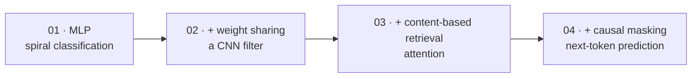
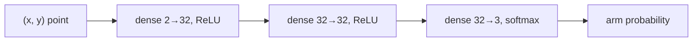
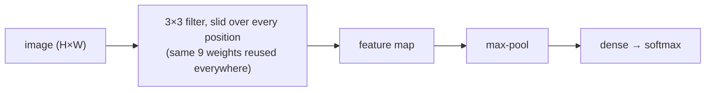
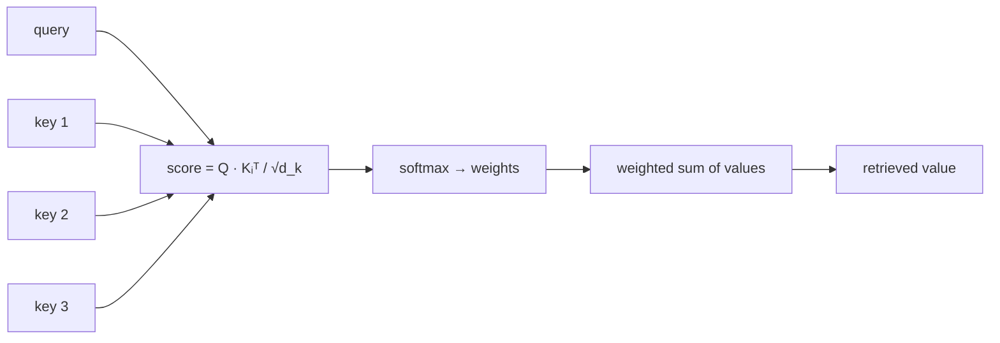
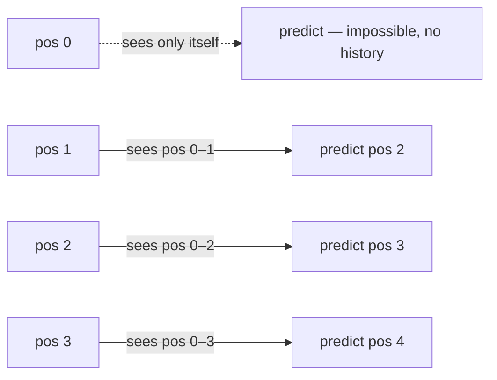

# Part 4 — Build Neural Networks (draft)

> **Status:** markdown draft, pre-HTML. Renumbered from "Part 3" to "Part 4" (Part 2 is now PyTorch, Part 3 is Neural Network). Renamed from "Examples" per plan. Source lineage: v1 `part-3-examples.html` (all four examples, notebook links, traps table) restructured into the requested per-example template; existing v2 `part-3-examples.html` for current framing/titles. Each example links to a real, gradient-checked notebook already in the repo (`concept/code/0N_*.ipynb`, backed by `concept/examples/0N_*.py`) — this draft doesn't re-derive that code, only frames it.
>
> **Diagram note:** mermaid blocks stand in for interactive widgets to build in the HTML pass.
>
> **Written for a genuine beginner.** Each example leans on one plain-language picture — "a straight cut through a spiral," "the same 9 numbers, reused everywhere," "a lookup table where you don't know the row" — before any equation, so the mechanism is legible even to a reader seeing it for the first time.

---

## 00 · How these four fit together

Every example below reuses the previous one's machinery and adds exactly one new idea — nothing arrives from nowhere. All four are trained with the exact backprop formulas from Part 3 §09 (`δ`, `∂L/∂W = δxᵀ`, `∂L/∂x = Wᵀδ`) and the softmax + cross-entropy from Part 3 §06–§07.

---

## 01 · Classification, applied

### A spiral only a nonlinearity can untangle

**1. What is the problem.** Three tangled spiral arms on a page, each a different color. No matter how you angle a single straight line, it can separate at most a sliver of one arm from the rest — the arms wind around each other, so any straight cut is wrong somewhere along its length.

**2. What is the outcome.** A trained network that draws a *curved* decision boundary — three interleaved spiral regions, each correctly assigned to its arm, with accuracy a straight-line classifier structurally cannot reach regardless of how it's tuned.

**3. The example.** A synthetic dataset: 2D points sampled along three spiral arms, colored by which arm generated them. Purely synthetic and purely visual, so the decision boundary can be watched directly.

**4. Why a neural network is needed.** Part 3 §05 showed that without a nonlinearity, stacking layers collapses to one big linear function no matter how deep — a straight line (or plane) can never separate points that spiral around each other. This is that argument made concrete on data specifically designed to be linearly inseparable: any purely linear model (logistic regression, a single-layer network with no activation) provably tops out far below what a kinked network reaches here.

**5. The solution, briefly.** A `2 → 32 → 32 → 3` ReLU network, trained with Part 3's exact backprop and softmax + cross-entropy. Each dot is a training point, colored by its true arm; the shaded background is the network's current classification for every point in the plane. Training traces three straight-edged blobs folding themselves into three interleaved spirals.

> **Widget claim to check:** press Run and watch the shaded decision regions fold from straight-edged blobs into interleaved spiral shapes as training proceeds — direct visual evidence that a kinked network can do what a line cannot (already built as `spiralfig`/current v2 `spiralfig` — port/keep).

**6. Notebook.** `examples/01_mlp_spiral_classifier.py` — full `2→32→32→3` version, gradient-checked against numerical differentiation. [`concept/code/01_mlp_spiral_classifier.ipynb`](../../code/01_mlp_spiral_classifier.ipynb).

> **Trap:** loss drops fast, then the boundary looks like flat-edged polygons. Expected — a ReLU network's decision boundary is always piecewise-linear (Part 3 §05). The polygon edges are visible seams between linear pieces, not a bug; they smooth out visually with more units.

---

## 02 · Why convolutions exist

### One learned filter, doing what a dense layer can't

**1. What is the problem.** A vertical stripe and a horizontal stripe are the same pattern, just rotated — obvious to an eye, because an eye looks at the whole 2D shape at once. A model that flattens the image first never gets that view: it sees a row of numbers with no notion that some of them used to be stacked in a column.

**2. What is the outcome.** A single 3×3 filter that learns, from data alone, to detect one orientation of stripe — and generalizes to any position in the image, because the same 9 numbers are reused everywhere rather than learned separately per pixel.

**3. The example.** Small synthetic images containing either vertical or horizontal stripes. A minimal, visualizable case for a mechanism that scales to real images in the notebook.

**4. Why a neural network is needed.** Part 3 §04's "the dense layer never sees a picture" argument: flattening an image throws away which pixels were neighbors. A conv layer fixes this by **weight sharing** — sliding the same small set of weights over every position instead of learning a separate one per pixel. A dense layer can only solve this by memorizing pixel positions per pattern; a conv filter learns one small, reusable pattern and reuses it everywhere.

**5. The solution, briefly.** One 3×3 kernel, trained end-to-end to tell vertical stripes from horizontal ones. Watch the filter's own 9 numbers converge into a stripe-shaped pattern: strong along one direction, weak along the other — that *is* "detects vertical, not horizontal," visible as a matrix.

> **Widget claim to check:** the 3×3 filter's heatmap visibly converges toward a directional stripe pattern as training proceeds — teal (positive) strong along one axis, orange (negative) weak along the other (already built as `convfig` — port/keep).

| | This example | `examples/02_cnn_digit_classifier.py` | A real production CNN |
|---|---|---|---|
| Filters | 1 | a handful | dozens to hundreds, per layer |
| Layers | 1 conv layer | conv → pool → dense | many conv/pool blocks stacked |
| Detects | one pattern (stripe orientation) | enough to classify digits | hundreds of learned patterns, composed hierarchically |

Same mechanism at every scale — weight sharing across positions — just fewer filters and one layer here, so the single 3×3 heatmap is small enough to actually watch converge.

**6. Notebook.** `examples/02_cnn_digit_classifier.py` — full im2col conv forward/backward, max-pool, dense, gradient-checked to `~1e-9`, on real 8×8 digit images, reaching 90% test accuracy. [`concept/code/02_cnn_digit_classifier.ipynb`](../../code/02_cnn_digit_classifier.ipynb).

> **Trap:** the learned filter converges to detect horizontal, not vertical. Sign and orientation are arbitrary from random initialization (Part 3 §12) — nothing forces convergence toward one direction over the other. Check the accuracy readout, not which orientation it happened to land on.

---

## 03 · Attention, applied

### Retrieval by content, not position

**1. What is the problem.** Imagine a lookup table where you don't know which row your answer is in — you only know what its label should match. A plain array lookup needs a known position; this needs a *comparison* against every label to find the right one, wherever it happens to sit.

**2. What is the outcome.** A model that, given a probe key, learns to retrieve the value paired with the matching key — regardless of where in the sequence that pair sits — purely by comparing content, not position.

**3. The example.** A short fixed sequence of key–value pairs plus one query key. Task: return the value whose key matches the query.

**4. Why a neural network is needed.** This is the entire idea attention exists to solve, and it's a genuinely new operation, not a bigger version of §01–§02's machinery: score relevance with a dot product (Part 1 §04), separate "what I seek" (query) from "what I am" (key) with two learned projections, turn scores into weights with softmax (Part 3 §06), retrieve with a value projection and a weighted sum, and divide by `√d_k` so the softmax doesn't saturate. Part 5 derives all five steps formally; this example is that mechanism solving the simplest task it's built for.

**5. The solution, briefly.** Three bars, one per key–value pair — bar height is the attention weight on that pair, and the pair whose key actually matches the query turns solid once the model is confident. Untrained, weights start near ⅓/⅓/⅓ — no basis to prefer any position. Training pulls almost all the weight onto the matching pair, purely because its key matches the query, not because of where it sits in the sequence.

> **Widget claim to check:** the bar for the key that actually matches the query grows to dominate the other two as training proceeds, from a near-uniform start (already built as `retfig`/`attnfig` — port/keep).

**6. Notebook.** `examples/03_mini_attention_retrieval.py` — full version: embeddings, `Wq`/`Wk`/`Wv`, output projection, softmax-over-attention-weights backprop, gradient-checked exactly. [`concept/code/03_mini_attention_retrieval.ipynb`](../../code/03_mini_attention_retrieval.ipynb).

> **Trap:** attention weights stay near ⅓/⅓/⅓ even after one training run. With only 3 keys the softmax starts high-entropy; it needs several gradient updates to sharpen toward the matching pair — this isn't a bug, just slow convergence at this tiny scale.

---

## 04 · Prediction, at every step

### The next symbol, predicted causally

**1. What is the problem.** Predicting what comes next is easy if you're allowed to peek ahead — you'd just be copying the answer. A model generating text one token at a time never gets that peek: every prediction has to come strictly from what came before it.

**2. What is the outcome.** A model that predicts the next symbol in a sequence at *every* position simultaneously, using only the tokens up to and including that position — the actual training setup for every autoregressive language model.

**3. The example.** A short alternating two-symbol series (e.g. `A B A B A B …`). Task: at every position, predict the next symbol using only what's been seen so far.

**4. Why a neural network is needed.** This reuses §03's Q/K/V attention but runs it at *every* position at once, under a **causal mask** (Part 5 §04): a position can only attend to itself and whatever came before it, never the future — otherwise "predict the next token" would just mean copying it. It's the hardest of the four because it combines two ideas (content-based retrieval + a structural masking constraint) rather than introducing one.

**5. The solution, briefly.** Position 0 can only see itself — predicting the very next symbol from a single token is genuinely impossible (that symbol hasn't appeared yet), so it stays wrong forever, and that's correct, not a bug. Every later position has enough history to know the alternating pattern; once trained, its attention concentrates on whichever earlier positions already carry the correct value — not on a fixed distance back, since a period-2 series has only two distinct values and several earlier positions are equally valid sources. The query matches by *content*, same as §03, not by counting backward.

> **Widget claim to check:** the attention-weight bar chart for a middle position shows weight concentrated on earlier positions holding the *matching value*, not a fixed lookback distance — and position 0's prediction accuracy never rises above chance, which is the correct behavior, not a failure (already built as `causalfig` — port/keep).

Both this example and §03 could, in principle, be solved a cheaper way — look back a fixed number of positions instead of comparing against all of them. Part 1 §11's "distance problem" is exactly why that cheaper option loses:

| | Fixed window (classical NLP) | Full attention (§03, §04) |
|---|---|---|
| Cost per position | O(window size) — cheap, constant | O(n) — scales with sequence length |
| Can reach the whole sequence? | No — anything outside the window is structurally invisible | Yes — every position is one dot product away, regardless of distance |
| Right choice for | Tasks where relevant context is always nearby | Tasks where the relevant token could be anywhere |

**6. Notebook.** `examples/04_causal_series_predictor.py` — gradient-checked. [`concept/code/04_causal_series_predictor.ipynb`](../../code/04_causal_series_predictor.ipynb).

> **Trap:** position 0's prediction never reaches high accuracy. Correct, not a bug — position 0 has no history to predict from. Judge model accuracy from position 1 onward.

---

## 05 · Reference: traps and a cheatsheet

| Symptom | Explanation |
|---|---|
| Numbers on this page don't match the linked `.py` file's printed output | These are shrunk-down in-browser stand-ins (fewer neurons, filters, or keys, for speed) — the real, gradient-checked numbers are in each linked `examples/0N_*.py` |
| You modify a linked `.py` file and the gradients look wrong | Same check as Part 3 §15: nudge one weight by `ε=1e-5`, compare `(L(w+ε)−L(w−ε))/2ε` to the analytic gradient — this is how every gradient in all four files was originally verified |

---

## 06 · Onward

Four examples, one machinery: forward → loss → backward → update, from Part 3, pointed at four different shapes. The nonlinearity that let §01 untangle a spiral is the same nonlinearity in every hidden layer since Part 3 §05. The weight-sharing that let §02's filter generalize across positions returns, differently, as attention's "any position, one dot product away" in §03. And §03's Q/K/V retrieval, once masked in §04, is the entire mechanism Part 5 now derives formally, end to end.
