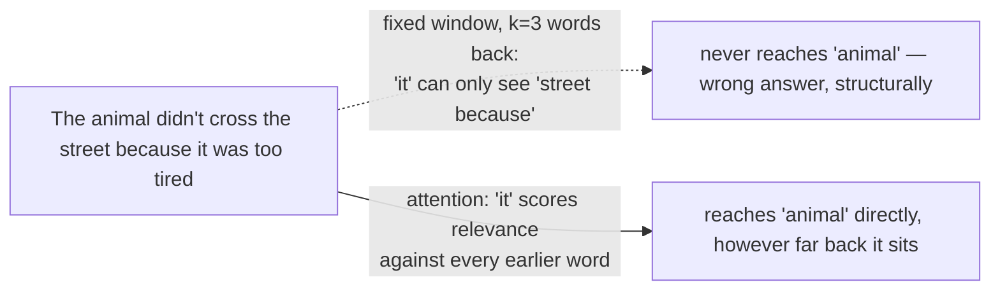
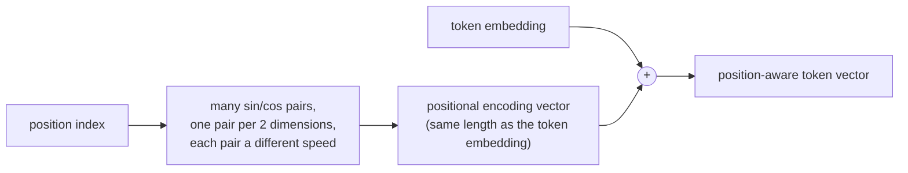
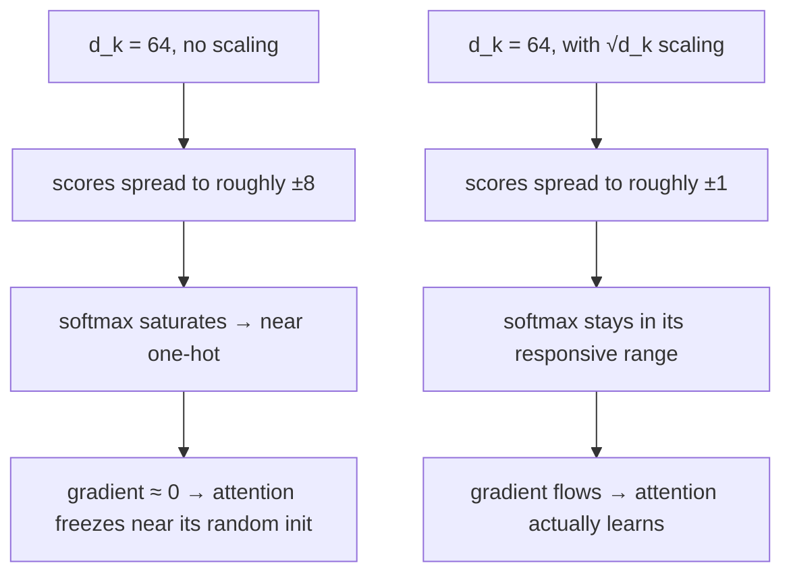
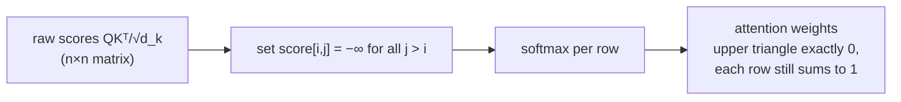
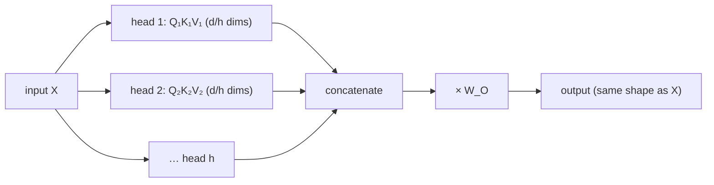
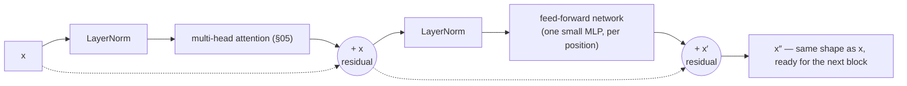
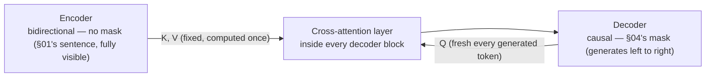
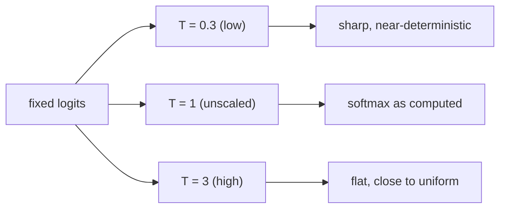

# Part 5 — Transformer Architecture (draft)

> **Status:** markdown draft, pre-HTML. Renumbered from "Part 4" to "Part 5" (Part 2 is now PyTorch, Part 3 is Neural Network, Part 4 is Build Neural Networks). Renamed from "Attention" per plan, and **merged**: this file now absorbs what was going to be a separate "Part 5" (block assembly, encoder/decoder, cross-attention, sampling) into one part, per plan. Source lineage: v1 `part-1-maths.html` §10–§12 (positional encoding, the five-step attention derivation, cost) + v1 `part-5-architecture.html` (paper summary, block assembly, encoder/decoder, cross-attention, sampling, traps, exercises) + existing v2 `part-4-attention.html` and `part-5-transformer.html` for current section scope.
>
> **Diagram note:** mermaid blocks stand in for interactive widgets to build in the HTML pass.
>
> **Written for a genuine beginner.** Every mechanism gets a plain-language picture first — a lookup that matches by content instead of position, a clock's hands for position, "gather then think" for attention vs. the feed-forward network — because the formulas are compact but the ideas behind them aren't obvious from the symbols alone.

---

## 00 · The paper, summarized

**"Attention Is All You Need" (Vaswani et al., 2017)** wasn't the first encoder-decoder architecture — RNN- and CNN-based sequence-to-sequence models, connected by an earlier, more limited form of attention, already existed. What was new was the paper's central claim: dispense with recurrence and convolution *entirely*, and build a sequence model out of attention alone.

**The problem it addressed.** Recurrent models (RNNs, LSTMs) process a sequence strictly one step at a time — token `t` waits for token `t−1` to finish. That serializes training (no parallelism across time) and makes long-range information fragile: a signal from token 3 has to survive being carried, step by step, all the way to token 300, and tends to fade.

**The core idea.** Let every position look directly at every other position, in one operation, weighted by *learned relevance* rather than fixed distance. No step-by-step carrying: any two positions are one dot product apart, regardless of how far apart they sit in the sequence.

| | RNN-based seq2seq | Transformer |
|---|---|---|
| Processing order | Strictly sequential — token `t` waits for token `t−1` | Every position processed in parallel |
| Long-range info | Must survive being carried step by step; tends to fade | Any two positions are one dot product apart (§03) |
| Training cost (reported) | ~2 months for a comparable task, pre-2017 | 3.5 days, 8 GPUs |
| Cost that grows with length | Linear in sequence length, but sequential | Quadratic in sequence length (§09) — the trade being made |

**The result.** Not a marginal improvement: **28.4 BLEU** on WMT 2014 English→German (a modest few points over prior work) but **41.8 BLEU** on English→French — a new single-model state of the art. A genuine quality jump *and* a training-time collapse from months to days is the kind of result a field reorganizes around — the same role ResNet's skip connection played for computer vision a few years earlier.

**What this part builds.** The one mechanism the paper's title refers to — attention — derived from scratch in five small steps (§03), then everything the paper wraps around it: positional encoding (§02), a stackable block (§06), the two-stack encoder/decoder design and cross-attention (§07), and how a trained decoder actually produces words (§08).

---

## 01 · Why attention, specifically

### The problem a fixed-position lookup can't solve

Take the sentence: *"The animal didn't cross the street because it was too tired."* What does "it" refer to? To represent "it" correctly, a model needs to pull in information from "animal" — six words back. In a different sentence, "it" would need to look somewhere else entirely — maybe two words back, maybe twenty. **The lookup cannot be hardcoded to a fixed distance; it has to be decided per-sentence, per-word, based on content.**

This rules out the classical alternative — a fixed context window (look back exactly `k` words, always):

| | Fixed window (classical NLP) | Attention |
|---|---|---|
| Cost per position | O(window size) — cheap, constant | O(n) — scales with sequence length |
| Can reach the whole sequence? | No — anything outside the window is structurally invisible | Yes — every position is one dot product away, regardless of distance |
| Fails when | The answer sits further back than the window reaches (exactly the "it"/"animal" case above) | Rarely, for reach — the real cost is quadratic total attention at long context (§09) |

**Why we need it, concretely:** without a mechanism that can reach *any* earlier position based on what it actually contains, "The animal didn't cross the street because it was too tired" and a version where "it" refers to something entirely different are indistinguishable to a fixed-window model that happens to have the wrong window size. Attention is the fix: **each word dynamically decides which other words to read from, based on their content, not their position.**



---

## 02 · Words as vectors, and the problem of order

Assigning "cat" = 1, "dog" = 2 is worse than useless — it implies dog is twice cat. Instead, give every token a full vector of coordinates, learned by gradient descent like everything else (Part 3 §11). A sequence of `n` tokens becomes a matrix with **one row per position**.

> Models work with **tokens**, not words exactly — chunks produced by splitting text so common words stay whole and rare ones break into pieces. Read "token" as "word-ish chunk"; nothing in the maths below changes.

**A problem you wouldn't anticipate.** The mechanism built in §03–§05 computes, for each token, a weighted sum over all the others. But addition doesn't care about order: `a + b + c = c + b + a`. Shuffle the input rows and the outputs shuffle identically, contents unchanged.

> **"Dog bites man" and "man bites dog" would be literally indistinguishable to the architecture.** Order isn't weakened by this mechanism; it's completely absent from it.

Since the machinery only sees vectors, position has to be written *into* the vectors. Requirements: every position distinct; values bounded (so appending the raw index is out — it grows unboundedly with sequence length); and "ten apart" should look similar whether you're at position 20 or position 2000.

**The picture: clock hands.** A clock encodes time in a bounded way using several hands at different speeds — the second hand distinguishes nearby moments, the hour hand distinguishes broad ranges, and every hand stays on the same circle forever. So: many sine waves at wildly different wavelengths, one pair per two coordinates of the embedding.

```
PE(pos, 2i)   = sin( pos / 10000^(2i/d) )
PE(pos, 2i+1) = cos( pos / 10000^(2i/d) )
```

`pos` is the token's position, `d` is the embedding dimension, `i` indexes which pair of coordinates — each pair is one "hand," larger `i` means a slower hand.


> **Widget claim to check:** dragging the position slider shows fast-oscillating columns (fine-grained "hands") next to slow-oscillating ones (coarse "hands"), and the position-similarity curve peaks at the selected position and decays with distance in the *same shape* regardless of which position is selected — the third requirement, satisfied (already built as `posfig` — port/keep).

Sine *and* cosine per hand because locating a point on a circle needs two coordinates — and with both, shifting position becomes a rotation, a linear operation the model learns easily.

---

## 03 · Built in five steps, each fixing the last

### Step 1 — score relevance

Token `i` needs a relevance score for token `j`. The tool is already built: a dot product measures alignment and returns one number (Part 1 §04). So `score(i,j) = xᵢ · xⱼ`.

### Step 2 — separate "what I seek" from "what I am"

That only scores high when two words are *similar*. But "it" isn't seeking something similar to itself — it's seeking a noun it could refer to. What you *want* and what you *are* are different things. So project into two spaces with two learned matrices: `Q = XW_Q` ("what I'm looking for") and `K = XW_K` ("what I advertise myself as"). Now the score is asymmetric, as it should be — "it" can score high against "animal" without "animal" scoring equally high against "it."

### Step 3 — turn scores into weights

Raw scores are unbounded; a proper weighted average needs weights summing to 1. Part 3 §06 already built that: **softmax**, applied along each row.

### Step 4 — decide what gets retrieved

When `i` attends to `j`, what does it actually receive? Not the key — a key is an index label, optimized for being *findable*, not *useful*. So a third projection carries the payload: `V = XW_V`. Three roles, three matrices, because "what I want," "how I'm found," and "what I give" are genuinely three different things.

```
Attention(Q, K, V) = softmax( QKᵀ / √d_k ) V
```

Everything above is now motivated except the `√d_k`.

### Step 5 — the scaling factor

**This is the most-asked question about transformers, so derive it rather than quoting "for numerical stability."** Suppose the entries of `q` and `k` are roughly independent with mean 0 and variance 1 (what initialization and LayerNorm arrange). Their dot product is a sum of `d_k` products. Each product has variance 1 (Part 1 §10, Fact 2); variances of independent things add (Fact 1):

```
Var(q · k) = d_k     ⟹     typical size ≈ √d_k
```

So raw dot products grow with `d_k` itself, even though nothing about "relevance" changed. Divide by `√d_k` and the typical score returns to order 1, regardless of dimension.


> **Widget claim to check:** toggling scaling off at `d_k = 64` visibly widens the score distribution and collapses the softmax output toward one-hot, with the resulting gradient falling by two to three orders of magnitude — pushing `d_k` to 256 makes it worse still; toggling scaling back on returns the spread to roughly ±1 (already built as `dkfig` — port/keep). In an interview, give this variance derivation, not "for numerical stability."

---

## 04 · No peeking: the causal mask

A model predicting the next token must not let position `i` see positions after it, or it could simply read the answer off. Before the softmax, set every score where `j > i` to `−∞`. Since `e^−∞ = 0`, those weights become exactly zero. (In code, a large negative number like `−1e9`.) Each row still sums to 1 — the mask *redistributes* attention among the permitted tokens rather than shrinking it.


> **Widget claim to check:** applying the causal mask to a full n×n attention heatmap zeroes the entire upper triangle, and the remaining weights in each row visibly redistribute to fill the gap — every row still sums to exactly 1 (already built as `maskfig` — port/keep).

This is what lets training run on every position of a sequence simultaneously, in one forward pass, while keeping every position honest — a large part of why transformers train so much faster than the recurrent models that came before them (§00's training-time comparison).

---

## 05 · Multiple questions at once: multi-head attention

One set of `Q, K, V` learns *one* notion of relevance. But a word plausibly needs several at once — "who is this referring to" and "what tense is this" are different questions, both worth asking about the same word simultaneously. So run `h` attention operations in parallel, each in a subspace of `d_k = d/h` dimensions, then concatenate and mix with an output matrix `W_O`.



Total cost is roughly unchanged — you're **partitioning** capacity among specialists, not adding it. Output shape equals input shape, which is what lets attention operations stack into blocks (§06).

**Parameter count per block:** attention is four `d×d` matrices ≈ `4d²`; the FFN (§06) is `d×4d` then `4d×d` ≈ `8d²`. So **≈ 12d²** per block. At `d = 4096` with 32 blocks, that's about 6.4 billion parameters, plus embeddings.

---

## 06 · Assembling the block

### Attention wrapped in residuals and normalization

§03–§05 built one operation: multi-head self-attention, input shape in, same shape out. Turning that into a stackable **block** — the thing repeated `L` times to build a real model — needs two more ingredients, and it's worth walking as a sequence of decisions rather than swallowing whole as one equation:

```
x′ = x + MHA(LN(x))       x″ = x′ + FFN(LN(x′))
```



**LayerNorm** rescales each token's vector to a consistent scale before it enters attention or the FFN — the same "keep activations from exploding or vanishing" concern Part 3 §12 raised for initialization, now enforced at every layer rather than just at the start.

**The residual connection** (`+ x`) is the fix for Part 3 §10's vanishing-gradient problem, applied here: it gives the gradient a direct, untransformed path backward through every block, so a signal doesn't have to survive being multiplied by dozens of Jacobians in sequence to reach an early block. Two residual connections per block, not one — each protects a different sub-layer. Miss either and stacking six of these with no bypass means the earliest blocks stop learning, exactly as Part 3 §10 predicts.

> **Attention moves information between positions. The FFN processes each position on its own.** Attention gathers; the FFN thinks about what was gathered.

> **Note:** this equation uses **pre-norm** (LayerNorm before each sub-layer) — the now-more-common convention. The original paper used **post-norm** (LayerNorm after). Both appear in real models; the residual math is identical either way, only the order shifts.

---

## 07 · Two shapes, two jobs: encoder, decoder, or both

### Why the original paper used two stacks

§01's motivating sentence — *"The animal didn't cross the street because it was too tired"* — resolves "it" using "tired," a word that comes **after** it. That's fine for a block that sees the whole sentence at once. It's a real problem for anything wearing §04's causal mask, which by design is never allowed to look forward.

**Could a causal-only model translate this sentence?** Imagine generating the French translation one word at a time, left to right, under the causal mask. By the time you need to decide whether "it" becomes *il* (masculine, matching *animal*) or something else, "tired" — the word that disambiguates it — hasn't been generated yet, and in the source sentence it comes *after* "it" too. A purely causal model reading left to right structurally cannot have seen it.

This is why the original Transformer is two stacks, not one: an **encoder** that reads the whole source sentence at once, with no mask at all, and a **decoder** that generates the target sentence causally — but is allowed to consult the encoder's already-complete understanding whenever it needs to. That consultation is **cross-attention**.

| Architecture | Access pattern | Good at | Example |
|---|---|---|---|
| Encoder-only | Bidirectional — every position sees every other | Understanding a complete input: classification, fill-in-the-blank | BERT |
| Decoder-only | Causal — only backward | Generating one token at a time from what came before | GPT, and nearly every current LLM |
| Encoder-decoder | Both, connected by cross-attention | Transforming one full sequence into a different one | Translation, summarization — T5, MarianMT |


> **Widget claim to check:** the same sentence, the same attention mechanism, only the mask toggled — in encoder mode every row (including "it") reaches every column ("tired" included); in decoder mode everything past the diagonal is dark, so "it" structurally cannot see "tired," no matter how the model was trained (already built as `edfig` — port/keep).

### Cross-attention: the wire between the stacks

Structurally it's the identical `softmax(QKᵀ/√d_k)V` from §03 — only where Q, K, and V come from changes:

| Role | Comes from |
|---|---|
| Query (Q) | The decoder's own masked self-attention output — "what am I trying to say next" |
| Key (K) | The encoder's final output — "what the source sentence contains" |
| Value (V) | The encoder's final output — the same tensor K came from |

> **No mask in cross-attention.** The decoder's masked self-attention (one step earlier in the same block) enforces "no looking at the future" — but that rule is about the decoder's *own* sequence. Cross-attention isn't attending within one sequence at all; it's fusing two different, already-complete ones. There is nothing to hide: the full encoder output is legitimately available for every generated token, from the first to the last.

> **This is not the KV-cache from §09.** §09's KV-cache is an inference-time speedup for the *decoder's own* self-attention keys and values, which don't change once computed for a given position. The encoder's K and V here are a different tensor entirely — computed once per input sentence (the encoder only runs once), then read by every decoder block's cross-attention layer, every generation step. Same instinct — don't recompute what hasn't changed — different tensor, different mechanism.

Run the encoder once, then generate token by token: the encoder box lights up once and never again — its K, V are fixed for the rest of the sentence — while the decoder and cross-attention run fresh on **every single generated token**. For a 20-token source sentence, 6 decoder blocks, and a 15-token generated translation: one encoder pass, and `6 × 15 = 90` cross-attention calls, each reading the same fixed encoder output.

---

## 08 · From numbers to a word

### Logits, temperature, and how a decoder actually speaks

The final layer of any decoder — encoder-decoder or decoder-only, no difference here — produces one raw score per vocabulary word: **logits**, not yet probabilities (the same logits Part 3 §06 introduced). Turning them into an actual choice of next word takes a few more decisions.

```
p = softmax(logits / T)
```

`T` is **temperature**. Small `T` (like 0.3) exaggerates the gaps between logits before softmax sees them, so the distribution sharpens toward the single best guess. Large `T` (like 3) compresses the gaps, flattening the distribution toward uniform. Same softmax as Part 3 §06, one extra knob in front of it.


> **Widget claim to check:** dragging temperature down sharpens the bar chart toward one dominant word; dragging it up flattens all bars toward equal height — the same fixed five-logit example reshaped continuously (already built as `tempfig` — port/keep).

**Top-k** keeps only the `k` highest-scoring words before renormalizing — a fixed-size eligible set. **Top-p** ("nucleus sampling") keeps the smallest set of words whose probabilities sum past `p` — an *adaptive*-size eligible set that grows when the model is uncertain and shrinks when it's confident.

| | Temperature | Top-k | Top-p |
|---|---|---|---|
| What it changes | Reshapes every probability continuously | Restricts eligible words to a fixed count | Restricts eligible words to an adaptive probability mass |
| Eligible-set size | Unchanged (all words stay eligible) | Fixed, always `k` | Varies — small when confident, large when uncertain |
| Failure mode if too aggressive | `T→0`: near-deterministic, repetitive | Too small `k`: repetitive, too large: incoherent | Too small `p`: repetitive, too large: incoherent |

The five candidate words and logits in the widget above are fixed and illustrative, chosen to show the shape of each effect, not pulled from a real model.

---

## 09 · The cost: attention is quadratic

Attention computes a score for **every pair** of positions: `n` tokens → `n²` pairs, so attention costs `O(n²d)` against the feed-forward network's `O(nd²)`. The crossover sits at `n = d`: below it, the FFN is the bottleneck (at `d = 4096` with a short prompt, attention is *not* what's costing you); above it, the quadratic term takes over and never lets go — double the context, attention quadruples.

That single fact drives an enormous amount of downstream engineering: FlashAttention (identical maths, tiled so the n×n matrix never touches slow memory), sliding-window and sparse attention, linear attention, and state-space models like Mamba.

**KV caching.** When generating one token at a time, earlier tokens' keys and values never change — so cache them. Each new token then costs `O(nd)` rather than `O(n²d)`. The cache holds `2 × n_layers × n × d` numbers, which becomes the real memory ceiling for long-context serving — and is exactly why **Grouped-Query Attention** (heads sharing K and V) was invented.

---

## 10 · Reference: traps and a cheatsheet

| Symptom / question | Resolution |
|---|---|
| "Isn't cross-attention just self-attention?" | Same formula, different sourcing — K/V from the encoder, Q from the decoder. Self-attention never mixes two different sequences (§07). |
| "Why no mask in cross-attention?" | Masking enforces autoregression within one sequence. Cross-attention fuses two already-complete ones — nothing is "in the future" relative to it (§07). |
| "Is the encoder's K/V cached like the KV-cache?" | Different mechanism. The encoder runs once per input either way; what's reused across decoder steps is its already-finished output, not an inference trick (§07, §09). |
| Output looks repetitive / stuck in a loop | Temperature too low, or top-k/top-p too narrow — the model has no room to pick anything but the single top choice (§08) |
| Output looks incoherent | Temperature too high, or top-p threshold too generous — low-probability, low-quality words are staying eligible (§08) |
| "Which should I use, top-k or top-p?" | Top-k is simpler and more predictable; top-p adapts its eligible set to the model's confidence, usually the better default for open-ended generation |

---

## 11 · Practice: exercises

1. Why can't a decoder-only model translate a full sentence the way an encoder-decoder can, even given unlimited training data?
2. A decoder block's cross-attention layer and its masked self-attention layer both compute `softmax(QKᵀ/√d_k)V`. Name every difference between the two calls.
3. Temperature is set to 0.01. What happens to generation, and why?
4. You set top-k = 1. What sampling strategy have you accidentally reproduced?
5. The encoder for a 20-token sentence runs once. How many times does its output get read by cross-attention over the course of generating a 15-token translation, assuming 6 decoder blocks?

<details>
<summary>Answers</summary>

1. It can only ever look backward. Resolving something like "it" in §01's example sentence requires a word that comes later — structurally invisible to a purely causal model reading left to right, no matter how much data it sees.
2. Masked self-attention: Q, K, V all come from the decoder's own sequence so far; a causal mask is applied. Cross-attention: Q comes from the decoder, K and V come from the encoder's output; no mask is applied, because there's no "future" within a fused pair of already-complete sequences.
3. Generation becomes almost perfectly deterministic — the highest-logit word gets pushed to probability ≈1, and the model will very likely produce the exact same output every time given the same input.
4. Greedy decoding — always take the single highest-probability word, with no randomness at all.
5. 90 times: 6 decoder blocks × 15 generated tokens, each one running its own cross-attention layer against the same encoder output.

</details>

---

## 12 · Glossary

| Term | Plain-language meaning |
|---|---|
| **Self-attention** | Attention where a sequence attends to itself — Q, K, V all come from the same input |
| **Cross-attention** | Attention where the query comes from one sequence (a decoder) and the key/value from a different, already-finished one (an encoder) |
| **Query (Q)** | "What I'm looking for" — a learned projection of a token, used to score relevance to others |
| **Key (K)** | "What I advertise myself as" — a learned projection used to be found by others' queries |
| **Value (V)** | "What I actually hand over" once found — the payload retrieved |
| **Attention weight** | The softmax output for one (query, key) pair — how much of that value gets pulled in |
| **Scaling (√d_k)** | Division that keeps dot-product scores at a roughly constant size regardless of dimension, so softmax doesn't saturate |
| **Causal mask** | Setting future positions' scores to `−∞` before softmax, so a position can't see ahead |
| **Multi-head attention** | Several attention operations run in parallel subspaces, then concatenated and mixed |
| **Positional encoding** | Fixed sine/cosine vectors added to token embeddings so position is available to a mechanism that otherwise ignores order |
| **d_k / d_model** | Dimension of a single attention head's Q/K/V (`d_k`) vs. the full model's embedding width (`d_model`) |
| **LayerNorm** | Rescales each token's vector to a consistent scale before it enters a sub-layer |
| **Residual connection** | Adding a sub-layer's input back onto its output (`x + F(x)`), giving gradients a direct path backward through deep stacks |
| **Block** | One self-attention sub-layer plus one feed-forward sub-layer, each wrapped in a residual connection — the unit stacked `L` times to build a model |
| **Encoder** | A block stack with no mask — every position sees every other; reads a complete input once |
| **Decoder** | A block stack with a causal mask, generating one token at a time |
| **Logit** | A raw, unbounded output number before softmax turns it into a probability (Part 3 §06) |
| **Temperature (T)** | A knob dividing logits before softmax — low sharpens, high flattens the resulting distribution |
| **Top-k sampling** | Restrict word choice to the `k` highest-probability words, then renormalize |
| **Top-p (nucleus) sampling** | Restrict word choice to the smallest set of words whose probabilities sum past `p` |
| **KV cache** | Storing already-computed keys/values during generation so they aren't recomputed every step |

---

## 13 · Onward

Nothing in this part was a new kind of formula — it's the same softmax, the same `Q/K/V`, the same residual connection built in §03–§06, pointed at a second sequence (§07) and then at a vocabulary instead of a hidden layer (§08). One part remains: wiring all of this — Part 1's maths, Part 2's PyTorch, this part's full architecture and decoding strategies — into a small decoder-only model actually trained and generated from, end to end. That's Part 6.
