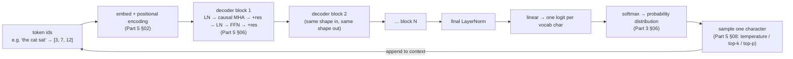
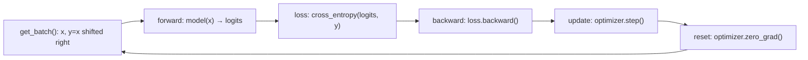
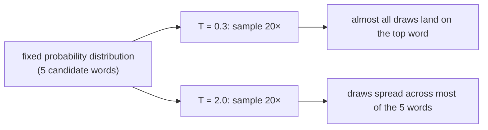

# Part 6 — LLM / Build a GPT (draft)

> **Status:** markdown draft, pre-HTML. Number unchanged (was already "Part 6" and stays "Part 6" — the renumbering upstream happens to leave this part's number untouched). Source lineage: v1 `part-6-build-gpt.html` (full TinyGPT code, tokenization, training, sampling, traps, summary, exercises) + existing v2 `part-6-llm.html` (current live page — its simplified "lookup table stand-in" for training is being **replaced** here with the real multi-block architecture, animated, per the explicit ask for a "how the transformer works" illustration) + v1 `part-1-maths.html` §12's "whole model, one loop" checkpoint concept, now built out as a real widget spec instead of a static chain diagram.
>
> **Diagram note:** mermaid blocks stand in for interactive widgets to build in the HTML pass.
>
> **Written for a genuine beginner.** Nothing below is a new idea — every piece was derived, motivated, and worked through by hand somewhere earlier in the course. This part's entire job is showing that the pieces really do click together into one running model, with special attention to actually *seeing* the whole architecture move, not just a simplified stand-in for it.

---

## 00 · What's already built

Check the inventory before assembling anything. Every piece a decoder-only Transformer needs already exists earlier in this course:

| Piece | Built in |
|---|---|
| Embeddings, matrices, the kink, softmax | Parts 1, 3 |
| Cross-entropy loss, gradient descent, backprop | Part 3 |
| `nn.Module`, the training loop, autograd | Part 2 |
| Self-attention, multi-head, positional encoding, √d_k scaling | Part 5 §02–§05 |
| The block: attention + residual + norm + feed-forward | Part 5 §06 |
| Temperature, top-k, top-p sampling | Part 5 §08 |

A GPT-style model is a **decoder-only** stack — no separate encoder, because there's no second sequence to consult; the model just keeps predicting its own next token from everything generated so far. What's left is exactly what a decoder-only model doesn't need from Part 5: no encoder, no cross-attention. Just Part 5 §06's block, stacked `N` times, in PyTorch, predicting the next character.

---

## 01 · The whole pipeline, animated

### Watch a real, multi-block Transformer generate one character

This is the section the earlier live page deliberately simplified away — its training demo (§04 below) uses a small stand-in specifically so the training loop is visible without a full backward pass hidden inside it. That trade-off is worth keeping for §04's specific purpose, but it means nowhere on the current site can you actually *watch the real multi-block architecture move, end to end*. This section is that missing piece.

```
tokens → embed + position → N × decoder block → final LN → linear → logits → softmax → sample → append, repeat
```



> **Widget claim to check — this is the flagship animation for this part.** A real (small: 2–3 blocks, ~16–32 dimensions) trained model, visualized end to end for one full generation step: token ids light up, the embedding + positional-encoding bars appear, then **each decoder block lights up in sequence** — its internal LayerNorm → attention (with a mini attention-weight heatmap, reusing Part 5 §03's visualization) → residual add → LayerNorm → feed-forward → residual add — with the residual-stream vector redrawn after every block so a reader can see it change shape-preserving but value-changing block by block. After the last block, the final projection produces a logit bar chart, softmax turns it into a probability bar chart, one bar is sampled and highlighted, and the sampled character animates back into the token sequence at the start, visibly growing the context by one. Play through 5–10 generation steps and watch actual, readable text accumulate one character at a time — not a canned animation, a real forward pass through real trained weights.
>
> This directly extends Part 7's existing single-step walkthrough (`wk` widget: tokenize → embed → position → one attention operation → prediction) by making the **whole multi-block stack** visible, not just one attention operation inside one block — Part 7 stays the "zoom into one operation" close-up; this is the "zoom out to the whole architecture, running" wide shot.

The loop-back arrow above is the entire idea of autoregressive generation, made literal: whatever gets sampled becomes part of the input for the *next* forward pass. Token `n+1` generally can't be produced until token `n` exists — which is why generation, unlike training, is inherently sequential.

---

## 02 · Tokenization

### Why characters, here specifically

A network needs numbers, not characters (Part 1 §03). The simplest tokenizer: collect every unique character in the training text, assign each one an integer. `"abc"` with vocabulary `{a:0, b:1, c:2}` becomes `[0, 1, 2]`. Real models use larger sub-word vocabularies (byte-pair encoding) for efficiency — common words stay whole, rare ones break into pieces, keeping the vocabulary a manageable size for a huge training set — but the core idea, a fixed lookup table mapping token to integer, doesn't change.

| | Character-level (this part) | Subword (BPE, real models) |
|---|---|---|
| Vocabulary size here | ~25 characters | Would need a trained merge table, unnecessary at this scale |
| Sequence length | Longer — one token per character | Shorter — common words compress to one token |
| What the model must learn | Spelling *and* structure, from scratch | Structure — spelling is handled by the tokenizer |
| Right choice for | This demo — small, transparent, nothing hidden | Any real model — vocabulary efficiency matters at scale |

> The tokenizer used in the runnable notebook is four lines: a sorted set of the unique characters in the training text, and two dictionaries mapping character ↔ index. That's the entire "tokenizer" at this scale.

---

## 03 · The model, in PyTorch

### The whole architecture, assembled

One block — causal self-attention, then a feed-forward network, each behind a residual connection (Part 5 §06) — stacked `N` times. This is Part 5 §06's block exactly, minus cross-attention, which a decoder-only model never has (there's no second sequence for it to fuse with).

```python
class CausalSelfAttention(nn.Module):
    # Part 5 §03–§04: softmax(QK^T/sqrt(d_k))V, masked so
    # position i never sees j > i.
    def __init__(self, d_model, n_heads, block_size):
        super().__init__()
        self.wq = nn.Linear(d_model, d_model, bias=False)
        self.wk = nn.Linear(d_model, d_model, bias=False)
        self.wv = nn.Linear(d_model, d_model, bias=False)
        self.wo = nn.Linear(d_model, d_model, bias=False)
        self.register_buffer("mask", torch.tril(torch.ones(block_size, block_size)).bool())

    def forward(self, x):
        # split into heads, score, mask, softmax, weight V, concat heads --
        # see the linked notebook for the full, runnable version
        ...

class DecoderBlock(nn.Module):
    # Part 5 §06's exact equation:
    # x' = x + MHA(LN(x));  x'' = x' + FFN(LN(x'))
    def __init__(self, d_model, n_heads, ffn_hidden, block_size):
        super().__init__()
        self.ln1 = nn.LayerNorm(d_model)
        self.attn = CausalSelfAttention(d_model, n_heads, block_size)
        self.ln2 = nn.LayerNorm(d_model)
        self.ffn = nn.Sequential(nn.Linear(d_model, ffn_hidden), nn.ReLU(), nn.Linear(ffn_hidden, d_model))

    def forward(self, x):
        x = x + self.attn(self.ln1(x))
        x = x + self.ffn(self.ln2(x))
        return x

class TinyGPT(nn.Module):
    def __init__(self, vocab_size, d_model, n_heads, n_blocks, ffn_hidden, block_size):
        super().__init__()
        self.tok_emb = nn.Embedding(vocab_size, d_model)
        self.register_buffer("pos_emb", sinusoidal_positional_encoding(block_size, d_model))
        self.blocks = nn.ModuleList([DecoderBlock(d_model, n_heads, ffn_hidden, block_size) for _ in range(n_blocks)])
        self.ln_f = nn.LayerNorm(d_model)
        self.head = nn.Linear(d_model, vocab_size)   # logits, one score per vocab char

    def forward(self, idx):
        x = self.tok_emb(idx) + self.pos_emb[:idx.shape[1]]   # embed + PE, added
        for block in self.blocks:
            x = block(x)
        return self.head(self.ln_f(x))
```

Read `TinyGPT.forward` against §01's diagram, line for line: `tok_emb + pos_emb` is "embed + position"; the `for block in self.blocks` loop is "N × decoder block"; `self.ln_f` is "final LN"; `self.head` is "linear → logits." Nothing in this class does anything §01's animation doesn't show happening.

> Full, runnable, gap-free version — including `generate()` with temperature/top-k/top-p — is in the repo's `examples/05_tiny_gpt.py`. It trains a 3-block, 32-dimensional model on a handful of sentences in a few seconds on a CPU.

---

## 04 · Training it

### The same five calls, one more time

Nothing new here either — Part 2 §05's loop, with next-character cross-entropy as the loss.

```python
def train(model, steps=800, batch_size=16, lr=3e-3):
    optimizer = torch.optim.AdamW(model.parameters(), lr=lr)
    model.train()
    for step in range(steps):
        x, y = get_batch(batch_size, BLOCK_SIZE)      # y is x shifted one character right
        logits = model(x)                              # forward
        loss = F.cross_entropy(logits.view(-1, VOCAB_SIZE), y.view(-1))  # loss
        loss.backward()                                 # backward
        optimizer.step()                                # update
        optimizer.zero_grad()                           # reset
```


> **Widget claim to check:** training on a real ~250-character toy corpus, the loss curve visibly falls over a few hundred steps — the exact "forward, loss, backward, update, repeat" loop from Part 2 §05, on real text (already built as `trainfig` — extend it to plot against the real multi-block model from §01/§03, not the lookup-table stand-in currently used).

> **Trap: a handful of sentences will overfit — and that's fine here.** Trained on a ~250-character toy corpus, loss falls to near zero and the model reproduces training sentences almost verbatim. That's **overfitting** exactly as Part 3 §13 defined it — memorizing rather than generalizing — and normally a red flag. Here it's expected: the point is watching every mechanism run correctly end to end, not training a model that generalizes to sentences it never saw. A real model earns the right to generalize with orders of magnitude more data.

---

## 05 · Generating

### Sampling, not the single best guess

Part 5 §08 showed how temperature, top-k, and top-p *reshape* a probability distribution. What that section didn't show: reshaping alone changes nothing if you always take the single highest-probability word — the argmax doesn't move just because the gaps around it changed. The effect only shows up once you actually **sample**, repeatedly, and watch the outcomes vary.

**Predict first — at T=0.3, how much would repeated draws vary?** Given a fixed distribution over five possible next words continuing *"...it did not ___"*, if you sampled from it 20 times at a low temperature, would you expect mostly the same word over and over, or a healthy mix of all five? What about at a high temperature?


> **Widget claim to check:** the dashed outline is the reshaped probability after temperature/top-k/top-p (Part 5 §08's exact widget); the solid filled bar is the *actual count* out of every draw so far — real randomness, drawn client-side, not a canned animation. At low T the filled bars converge almost entirely onto one outline; at high T they spread out to roughly match all five outlines (already built as `samplefig` — port/keep).

---

## 06 · Reference: traps and a cheatsheet

| Symptom | Likely cause |
|---|---|
| Loss won't drop below ~3 (roughly `ln(vocab_size)`) | Same signature as Part 3's "stuck loss" bug — check the learning rate isn't ~0, and that `y` is actually shifted one position from `x` |
| Shape error inside attention | Almost always the head-split/merge reshape — trace `(B,T,D) → (B,H,T,D/H) → (B,T,D)` by hand |
| Generated text is memorized verbatim | Expected at this corpus size — see §04's trap callout, not a bug |
| Generation crashes past a certain length | Context exceeded `BLOCK_SIZE` — the positional encoding buffer and the causal mask are both sized for a maximum length |
| Output is the same every run despite temperature > 0 | Check `torch.multinomial` is actually being called — an accidental `argmax` ignores temperature entirely, silently |

---

## 07 · Practice: exercises

1. Why does `TinyGPT` have no cross-attention layer anywhere in its code, unlike Part 5's encoder-decoder diagram?
2. The training corpus is about 250 characters. Roughly how many parameters does the 3-block, 32-dimensional model in the notebook have (see Part 5 §05's ≈12d² per block, plus the embedding and output layers)? What does that ratio suggest about overfitting?
3. You increase `BLOCK_SIZE` after training a model and try to generate a longer sequence. What breaks, and why?
4. At `T=1.0` with no top-k or top-p filtering, is the highest-probability word guaranteed to be sampled? Why or why not?

<details>
<summary>Answers</summary>

1. Cross-attention exists to fuse a decoder with a separately-encoded second sequence. A decoder-only model, like this one, only ever has one sequence — its own — so there's nothing for cross-attention to connect to.
2. ≈12 × 32² × 3 blocks ≈ 36,900, plus a small embedding table (24 × 32) and output projection (32 × 24) — on the order of 39,000 parameters. Against a ~250-character corpus, that's vastly more parameters than training examples — memorization, not generalization, is the only possible outcome, exactly as Part 3 §13 predicts for a model with capacity that outstrips its data.
3. The positional encoding buffer and the causal mask buffer are both sized for the original `BLOCK_SIZE` at construction time. Indexing past that length either errors or silently reads garbage — the fix is retraining (or at least re-instantiating) with the new size.
4. No. Sampling at `T=1.0` means every word is chosen with probability equal to its softmax score — the highest-probability word is *more likely* than any other single word, but not guaranteed; only greedy decoding (equivalent to top-k=1) guarantees it.

</details>

---

## 08 · Glossary

| Term | Plain-language meaning |
|---|---|
| **Decoder-only model** | A Transformer with no encoder or cross-attention — every layer is causal self-attention over its own sequence |
| **Tokenizer** | The fixed lookup table mapping text chunks (characters, or subword pieces) to integers |
| **`block_size`** | The maximum sequence length a model was built and trained to handle |
| **`d_model`** | The width of the vector representing each token throughout the network |
| **Residual stream** | The running vector for each token, updated (not replaced) by each block via `x + F(x)` |
| **Autoregressive generation** | Predicting one token, appending it to the input, and repeating — each output feeds the next input |
| **Overfitting (in this context)** | A model memorizing a tiny training corpus almost verbatim — expected and harmless at this toy scale, a red flag at real scale |
| **AdamW** | The optimizer used in place of plain SGD — adapts the step size per parameter; a practical upgrade, not a new idea |

---

## 09 · What the whole course built

- **Part 1** derived every formula — dot products through backprop through attention's √d_k — from the problem it solves
- **Part 2** previewed the practical tool: tensors, autograd, `nn.Module`, the training loop — the automated version of what comes next
- **Part 3** opened the hood completely: a hand-written, ~60-line NumPy MLP, with a hand-derived backward pass, no framework hiding anything
- **Part 4** extended that same toolkit to four more models — classification, convolution, attention-based retrieval, causal prediction
- **Part 5** built the full Transformer architecture Part 1 didn't cover: the block, encoder vs. decoder, cross-attention, and how a trained model actually speaks
- **Part 6** — this part — wired all of it into one small, real, decoder-only Transformer, trained and sampled from, with the whole multi-block architecture actually visible in motion (§01)

> Every line of the linked notebook traces back to a specific, derived, motivated idea earlier in this course. Nothing in a much larger model changes that pattern — only the numbers get bigger.

---

## 10 · Onward

From here: run the linked notebook yourself, then try widening it (bigger `d_model`, more blocks), training it on a larger corpus, or swapping the character tokenizer for a real one. Part 7 walks the entire pipeline once more, zoomed into a single generation step in full detail, on one real sentence.
