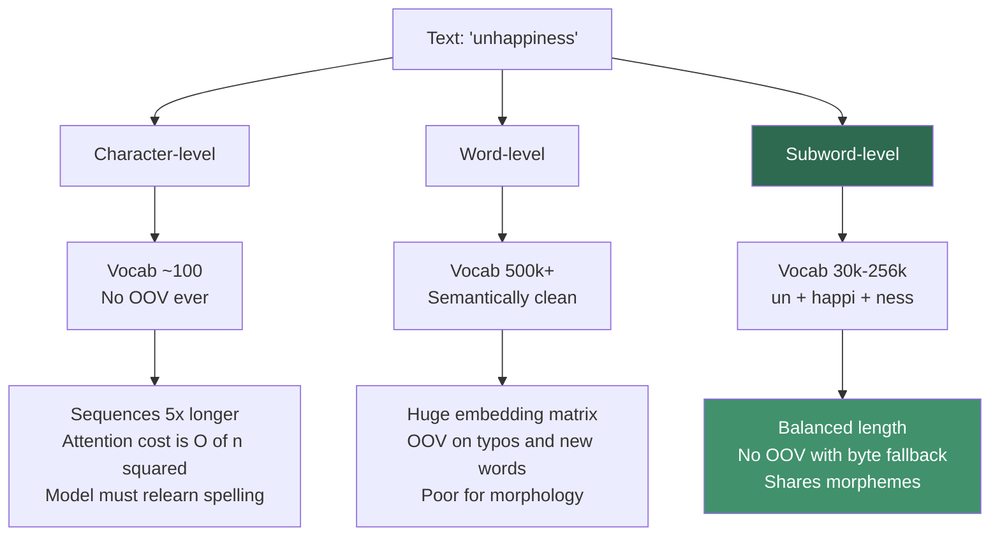
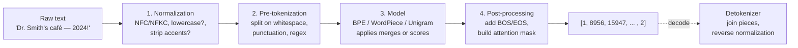
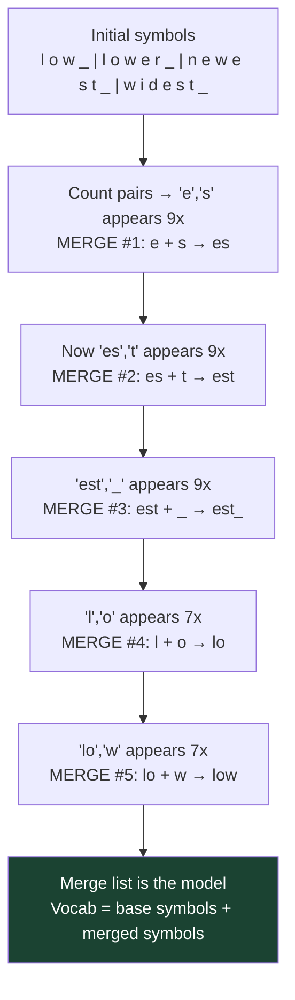
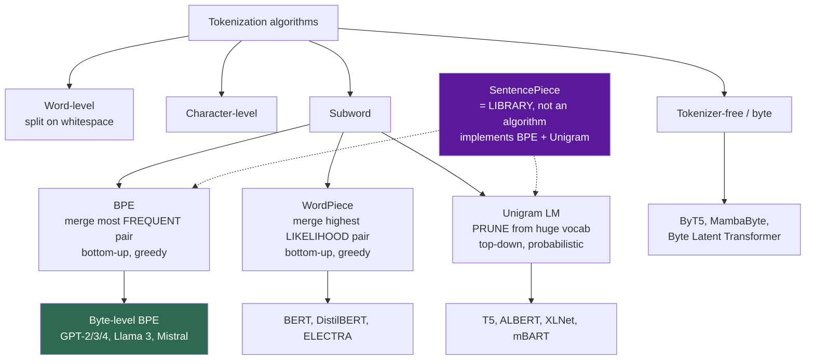
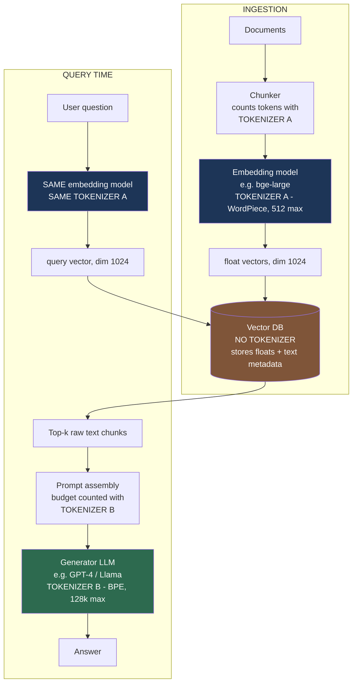
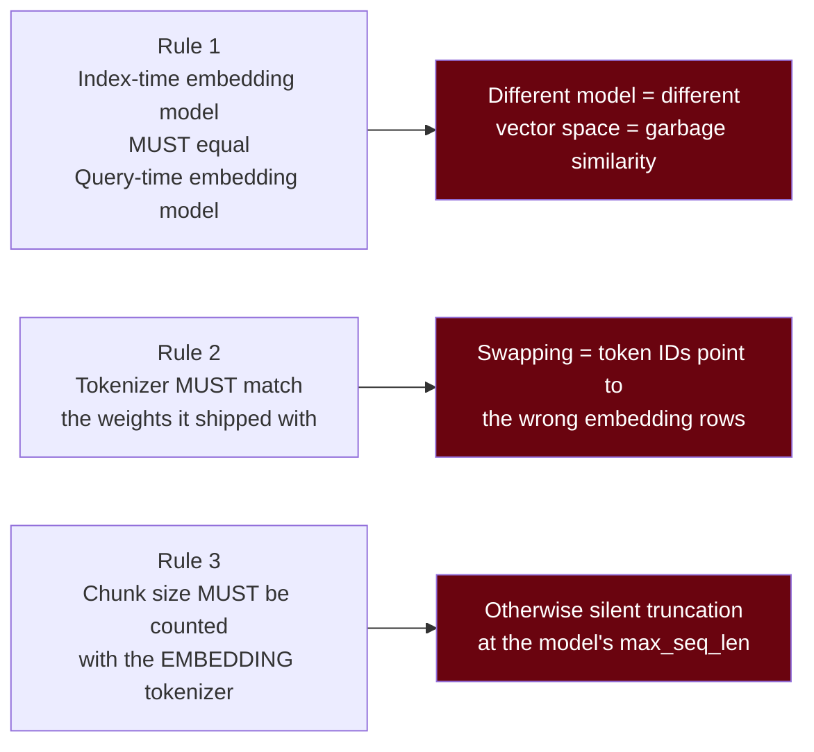
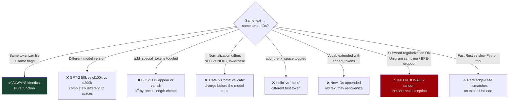

# Tokenizers in LLMs — A Practical Course

A hands-on course covering how text becomes numbers, why BPE won, what breaks in RAG pipelines, and what interviewers actually probe for.

---

## Table of Contents

1. [Module 1 — What is a tokenizer?](#module-1--what-is-a-tokenizer)
2. [Module 2 — BPE deep dive](#module-2--bpe-deep-dive)
3. [Module 3 — Other tokenization algorithms](#module-3--other-tokenization-algorithms)
4. [Module 4 — Tokenizers in RAG: embeddings + vector DBs](#module-4--tokenizers-in-rag-embeddings--vector-dbs)
5. [Module 5 — Are tokenizers deterministic?](#module-5--are-tokenizers-deterministic)
6. [Module 6 — Interview focus areas, traps, cheat sheet](#module-6--interview-focus-areas-traps-cheat-sheet)
7. [Module 7 — Sample interview questions](#module-7--sample-interview-questions)
8. [Labs](#labs)
9. [Glossary](#glossary)

### Setup

```bash
pip install tiktoken transformers tokenizers sentencepiece
```

---

## Module 1 — What is a tokenizer?

A neural network cannot consume text. It consumes vectors. A **tokenizer** is the deterministic, non-learned (well — *trained*, but not gradient-trained) bridge that maps a string to a sequence of integer IDs, and back.

```
"tokenization"  →  [3907, 2065]  →  [[0.02, -0.13, ...], [0.44, ...]]  →  Transformer
    text            token IDs           embedding vectors
```

Two things are often confused:

| Thing | What it does | Learned by |
|---|---|---|
| Tokenizer | `str → List[int]` | Frequency statistics over a corpus (no backprop) |
| Embedding matrix | `int → vector`, shape `[V, d]` | Gradient descent, part of the model |

The tokenizer's vocabulary size `V` **determines** the shape of the embedding matrix and the output softmax. This is why you cannot swap a tokenizer under a trained model.

### Why subwords?

Three naive options, all bad:



Subword tokenization is the compromise: frequent words stay whole, rare words decompose into reusable pieces.

### The full pipeline

A production tokenizer is four stages, not one:



Every stage is a place where two "compatible-looking" tokenizers silently diverge. Interviewers love stage 1 and stage 4.

### Sample code — see it happen

```python
import tiktoken

enc = tiktoken.get_encoding("cl100k_base")   # GPT-4 / text-embedding-3 family

text = "Tokenization isn't intuitive: 你好, café, 1234567."
ids = enc.encode(text)

print(len(text), "chars →", len(ids), "tokens")
for tid in ids:
    print(f"{tid:>7}  {enc.decode([tid])!r}")
```

Typical output shape:

```
     46 chars → 19 tokens
   3404  'Token'
   2065  'ization'
   4536  ' isn'
    956  "'t"
  42779  ' intuitive'
     25  ':'
  16423  ' 你'
  53901  '好'
    ...
```

Note three things immediately: `' intuitive'` **includes the leading space**, the apostrophe splits the word, and one Chinese character costs 1–3 tokens while an English word costs 1.

### Rules of thumb (English)

- ~4 characters per token
- ~0.75 words per token → 1,000 tokens ≈ 750 words
- Code: ~2.5–3 chars/token (whitespace and symbols are expensive)
- CJK / Devanagari / Thai: often 1.5–3× more tokens than English for the same meaning ("tokenizer tax")

---

## Module 2 — BPE deep dive

**Byte Pair Encoding** started as a 1994 compression algorithm (Philip Gage) and was repurposed for NMT by Sennrich, Haddow & Birch (2016). It is now the default for essentially every frontier LLM.

### The core idea

> Start from the smallest units. Repeatedly find the most frequent adjacent pair and merge it into a new symbol. Stop when you hit your target vocab size.

The output of training is an **ordered list of merge rules**. The order is the algorithm — encoding replays merges in exactly the rank they were learned.

### Training, visually

Corpus: `low ×5, lower ×2, newest ×6, widest ×3` (`_` = end-of-word marker)



Now encode the unseen word `lowest`:

```
l o w e s t _
→ apply #1  →  l o w es t _
→ apply #2  →  l o w est _
→ apply #3  →  l o w est_
→ apply #4  →  lo w est_
→ apply #5  →  low est_
Result: ["low", "est_"]     ← generalized to a word never seen in training
```

That generalization is the whole point.

### Byte-level BPE (what GPT-2 onward actually uses)

Classic BPE starts from Unicode characters, so it still needs an `<unk>` for unseen characters. **Byte-level BPE** starts from the 256 possible *bytes* of UTF-8.

Consequences:
- **Zero OOV, ever.** Any byte sequence — emoji, corrupted text, binary — is representable.
- Base vocab is exactly 256, tiny.
- GPT-2 applies a byte↔visible-character mapping so bytes are printable (that's why you see `Ġ` for space and `Ċ` for newline in raw GPT-2 vocab dumps).
- A regex pre-tokenizer splits text *before* BPE so merges never cross word boundaries in weird ways, and digits/punctuation are handled deliberately.

### Sample code — BPE from scratch (~40 lines)

```python
from collections import Counter, defaultdict

def train_bpe(corpus_counts, num_merges):
    """corpus_counts: {"low": 5, "lower": 2, ...}"""
    vocab = {tuple(list(w) + ["</w>"]): c for w, c in corpus_counts.items()}
    merges = []

    for _ in range(num_merges):
        pairs = Counter()
        for symbols, freq in vocab.items():
            for i in range(len(symbols) - 1):
                pairs[(symbols[i], symbols[i + 1])] += freq
        if not pairs:
            break

        best = max(pairs, key=pairs.get)          # ties broken by insertion order
        merges.append(best)
        a, b = best

        new_vocab = {}
        for symbols, freq in vocab.items():
            out, i = [], 0
            while i < len(symbols):
                if i < len(symbols) - 1 and symbols[i] == a and symbols[i + 1] == b:
                    out.append(a + b)
                    i += 2
                else:
                    out.append(symbols[i])
                    i += 1
            new_vocab[tuple(out)] = freq
        vocab = new_vocab

    return merges


def encode(word, merges):
    """Replay merges in learned rank order — this is the critical part."""
    symbols = list(word) + ["</w>"]
    ranks = {pair: i for i, pair in enumerate(merges)}

    while len(symbols) > 1:
        candidates = [
            (ranks[(symbols[i], symbols[i + 1])], i)
            for i in range(len(symbols) - 1)
            if (symbols[i], symbols[i + 1]) in ranks
        ]
        if not candidates:
            break
        _, i = min(candidates)                     # lowest rank = earliest merge
        symbols[i:i + 2] = [symbols[i] + symbols[i + 1]]

    return symbols


corpus = {"low": 5, "lower": 2, "newest": 6, "widest": 3}
merges = train_bpe(corpus, num_merges=10)

print("merges:", merges[:5])
print("lowest →", encode("lowest", merges))
print("newer  →", encode("newer", merges))
```

The `min(candidates)` line is where most from-scratch implementations get it wrong. BPE is **not** greedy longest-match; it is *rank-ordered replay*. Applying merges in the wrong order gives different token IDs for the same string.

### Sample code — train a real BPE with HuggingFace

```python
from tokenizers import Tokenizer, models, trainers, pre_tokenizers, decoders

tok = Tokenizer(models.BPE(unk_token=None))
tok.pre_tokenizer = pre_tokenizers.ByteLevel(add_prefix_space=True)
tok.decoder = decoders.ByteLevel()

trainer = trainers.BpeTrainer(
    vocab_size=8000,
    special_tokens=["<pad>", "<bos>", "<eos>"],
    initial_alphabet=pre_tokenizers.ByteLevel.alphabet(),   # all 256 bytes → no OOV
    show_progress=True,
)

tok.train_from_iterator(["your corpus line 1", "line 2", "..."], trainer)
tok.save("my-bpe.json")

out = tok.encode("hello unseen wörd 🚀")
print(out.tokens, out.ids)
print(tok.decode(out.ids))   # lossless round-trip
```

> **Further reading for Module 2** — [Sennrich et al. 2016 (arXiv:1508.07909)](https://arxiv.org/abs/1508.07909) for the original method, [`karpathy/minbpe`](https://github.com/karpathy/minbpe) for a clean reference implementation, and the [OpenAI Cookbook tiktoken notebook](https://github.com/openai/openai-cookbook/blob/main/examples/How_to_count_tokens_with_tiktoken.ipynb) for the counting patterns you will actually use in production.

---

## Module 3 — Other tokenization algorithms



### WordPiece (BERT)

Same bottom-up merging as BPE, but the selection criterion is a **likelihood score**, not raw frequency:

$$\text{score}(a,b) = \frac{\text{freq}(ab)}{\text{freq}(a) \times \text{freq}(b)}$$

This deliberately penalizes merging pairs whose parts are already common on their own. `de` + `##ing` are frequent individually, so WordPiece won't merge them just because the combination is common.

Encoding is **greedy longest-match-first** from the left, not merge replay. Continuation pieces get a `##` prefix:

```
"unaffable"  →  ["un", "##aff", "##able"]
```

### Unigram LM (SentencePiece, T5)

Runs the opposite direction:

1. Seed a **huge** candidate vocab (all substrings above a frequency threshold).
2. Fit a unigram language model over token sequences via EM.
3. For each token, compute the loss increase if it were removed.
4. Drop the worst ~10–20%. Repeat until target vocab size.

At inference it uses **Viterbi** to find the highest-probability segmentation. Because it's probabilistic, it can also *sample* alternative segmentations — **subword regularization**, a data augmentation trick that makes models robust to segmentation noise.

### SentencePiece — the most common interview mix-up

SentencePiece is a **library/framework**, not an algorithm. Its contribution is:

- Treats input as a raw Unicode stream — **no whitespace pre-tokenization required**, so it works for Japanese/Chinese/Thai.
- Encodes space as a visible meta-symbol `▁` (U+2581), making detokenization **fully lossless and reversible**.
- Implements *both* BPE and Unigram as swappable back-ends.

So "Llama uses SentencePiece" and "Llama uses BPE" are both true for Llama 1/2 — SentencePiece is the tool, BPE is the model. (Llama 3 moved to a tiktoken-style byte-level BPE.)

### Comparison table

| | BPE | WordPiece | Unigram | Byte-level BPE |
|---|---|---|---|---|
| Direction | Bottom-up | Bottom-up | Top-down (prune) | Bottom-up |
| Merge criterion | Max frequency | Max likelihood ratio | Min loss on removal | Max frequency |
| Encoding | Replay merges by rank | Greedy longest-match | Viterbi (probabilistic) | Replay merges by rank |
| OOV handling | `<unk>` or byte fallback | `[UNK]` | `<unk>` / byte fallback | **Impossible** |
| Multiple segmentations | No | No | **Yes** (sampling) | No |
| Continuation marker | `</w>` or none | `##` | `▁` | `Ġ` for space |
| Used by | GPT-2, RoBERTa | BERT, ELECTRA | T5, ALBERT, XLNet | GPT-4, Llama 3, Mistral |

### Approximate vocab sizes (for scale intuition)

| Model family | Algorithm | Vocab (approx) |
|---|---|---|
| BERT | WordPiece | 30k |
| GPT-2 | Byte-level BPE | 50k |
| T5 | Unigram (SentencePiece) | 32k |
| Llama 2 / Mistral | BPE (SentencePiece) | 32k |
| GPT-4 (`cl100k_base`) | Byte-level BPE | ~100k |
| Llama 3 | Byte-level BPE (tiktoken-style) | ~128k |
| GPT-4o (`o200k_base`) | Byte-level BPE | ~200k |
| Gemma | SentencePiece | ~256k |

**The trend is upward.** Bigger vocab → fewer tokens per document → cheaper inference and longer effective context, at the cost of a fatter embedding matrix (`V × d` params) and a more expensive output softmax. Larger vocabs also help non-English languages disproportionately.

### Sample code — compare tokenizers side by side

```python
import tiktoken
from transformers import AutoTokenizer

samples = [
    "The quick brown fox jumps over the lazy dog.",
    "def fibonacci(n): return n if n < 2 else fibonacci(n-1) + fibonacci(n-2)",
    "人工知能は世界を変えています。",
    "1234567890",
]

encoders = {
    "gpt2":       lambda s: tiktoken.get_encoding("gpt2").encode(s),
    "cl100k":     lambda s: tiktoken.get_encoding("cl100k_base").encode(s),
    "o200k":      lambda s: tiktoken.get_encoding("o200k_base").encode(s),
    "bert-base":  lambda s: AutoTokenizer.from_pretrained("bert-base-uncased").encode(s),
}

print(f"{'text':<45} " + " ".join(f"{k:>9}" for k in encoders))
for s in samples:
    counts = " ".join(f"{len(f(s)):>9}" for f in encoders.values())
    print(f"{s[:43]:<45} {counts}")
```

You will see the CJK line and the digit line vary wildly across tokenizers. That variance *is* the cost model of your application.

> **Further reading for Module 3** — [Kudo 2018 (arXiv:1804.10959)](https://arxiv.org/abs/1804.10959) for Unigram, [Kudo & Richardson 2018 (arXiv:1808.06226)](https://arxiv.org/abs/1808.06226) for SentencePiece, [Tao et al. 2024 (arXiv:2407.13623)](https://arxiv.org/abs/2407.13623) for the vocab-size scaling argument behind the 32k → 256k trend, and [HuggingFace NLP Course Ch. 6](https://huggingface.co/learn/nlp-course/chapter6/1) for side-by-side algorithm walkthroughs.

---

## Module 4 — Tokenizers in RAG: embeddings + vector DBs

**The single question this module answers: do I need the same tokenizer for my embedding model, my vector DB, and my LLM?**

### Short answer

**No. And you cannot force it either.** They are three independent components:

| Component | Has a tokenizer? | Whose? |
|---|---|---|
| Embedding model | Yes | Its own, frozen, shipped with its weights |
| Vector database | **No** | It stores `float[]`, it never sees text |
| Generator LLM | Yes | Its own, frozen, shipped with its weights |

A vector DB stores opaque float arrays plus metadata. Pinecone/Qdrant/pgvector/Weaviate have no concept of a token. So there is nothing to "match."

### The architecture



Notice: **Tokenizer A and Tokenizer B are different and that is completely fine.** The vector DB is the airlock between them — it passes *floats* to the retriever and *plain text* to the prompt builder.

### What DOES have to match



### The classic production bug

You chunk documents to "500 tokens" using `tiktoken.cl100k_base` because that's the snippet everyone copies. Your embedding model is `bge-large-en` with a **512-token WordPiece** limit.

For English prose, 500 cl100k tokens ≈ 560–650 WordPiece tokens. The embedding model **silently truncates** past 512. The tail of every chunk is never embedded. Retrieval quality degrades and nothing errors out.

```python
# ❌ WRONG — counting with the wrong tokenizer
import tiktoken
enc = tiktoken.get_encoding("cl100k_base")
chunks = split_by_tokens(doc, enc, max_tokens=500)   # embedder truncates these

# ✅ RIGHT — count with the tokenizer that owns the constraint
from transformers import AutoTokenizer
emb_tok = AutoTokenizer.from_pretrained("BAAI/bge-large-en-v1.5")
print(emb_tok.model_max_length)   # 512 — this is the real budget

def chunk_for_embedder(text, tok, max_tokens=480, overlap=64):
    ids = tok.encode(text, add_special_tokens=False)
    step = max_tokens - overlap
    return [tok.decode(ids[i:i + max_tokens]) for i in range(0, len(ids), step)]

chunks = chunk_for_embedder(doc, emb_tok)
```

Leave headroom (480 not 512) for the `[CLS]`/`[SEP]` special tokens the model adds in post-processing.

### Two budgets, two tokenizers

```python
# Budget 1: does each chunk fit the EMBEDDER?
assert all(len(emb_tok.encode(c)) <= 512 for c in chunks)

# Budget 2: does the assembled prompt fit the GENERATOR?
gen_enc = tiktoken.get_encoding("o200k_base")
prompt = SYSTEM + "\n\n".join(retrieved) + question
assert len(gen_enc.encode(prompt)) < 120_000
```

Two different tokenizers, two different limits, both enforced. That is the correct design.

### Verification snippet

```python
def audit(text, emb_tok, gen_enc):
    e = emb_tok.encode(text, add_special_tokens=True)
    g = gen_enc.encode(text)
    print(f"chars={len(text)}  embedder={len(e)}  generator={len(g)}  "
          f"ratio={len(e)/max(len(g),1):.2f}")
    if len(e) > emb_tok.model_max_length:
        print(f"  ⚠️  TRUNCATION: {len(e) - emb_tok.model_max_length} tokens dropped")
```

Run this over a sample of your corpus before you ever index it.

---

## Module 5 — Are tokenizers deterministic?

**Yes.** A tokenizer is a pure function. Same input + same tokenizer artifact + same config → byte-identical output IDs. Every time. No randomness, no seed, no GPU nondeterminism.

```python
import tiktoken, random
enc = tiktoken.get_encoding("cl100k_base")
s = "Determinism check 🚀 café"
assert all(enc.encode(s) == enc.encode(s) for _ in range(1000))   # always passes
```

This must be true — otherwise a model's learned embedding rows would be meaningless.

### But: deterministic ≠ portable ≠ stable across configs



### The one genuine source of randomness

**Subword regularization** (Kudo 2018) and **BPE-dropout** (Provilkov 2019) deliberately sample among valid segmentations to regularize *training*. This is opt-in and off by default:

```python
import sentencepiece as spm
sp = spm.SentencePieceProcessor(model_file="m.model")

# Deterministic — the default
print(sp.encode("tokenization", out_type=str))
print(sp.encode("tokenization", out_type=str))   # identical

# Stochastic — explicitly requested
for _ in range(3):
    print(sp.encode("tokenization", out_type=str,
                    enable_sampling=True, alpha=0.1, nbest_size=-1))
# ['▁token', 'ization'] / ['▁to', 'ken', 'ization'] / ['▁tok', 'en', 'iz', 'ation']
```

You will basically never enable this at inference time.

### Practical stability checklist

- ✅ Pin the tokenizer artifact (`tokenizer.json`, `.model`) alongside model weights — same commit hash, same version.
- ✅ Pin library versions; `tiktoken` and `transformers` upgrades have changed defaults before.
- ✅ Store the tokenizer name/version in your vector DB metadata so you know what produced each index.
- ✅ Be explicit about `add_special_tokens` — never rely on the default.
- ✅ Golden-file test: hash the IDs of a fixed corpus in CI and fail on drift.

```python
import hashlib, json

def tokenizer_fingerprint(enc, corpus):
    ids = [enc.encode(s) for s in corpus]
    return hashlib.sha256(json.dumps(ids).encode()).hexdigest()[:16]

GOLDEN = "a3f9c1d2e4b78056"
assert tokenizer_fingerprint(enc, FIXED_CORPUS) == GOLDEN, "tokenizer drifted!"
```

> **Further reading for Module 5** — [Provilkov et al. 2020 (arXiv:1910.13267)](https://arxiv.org/abs/1910.13267) for BPE-dropout, the one intentional source of randomness, and the [`google/sentencepiece`](https://github.com/google/sentencepiece) docs for the `enable_sampling` / `alpha` / `nbest_size` parameters used above.

---

## Module 6 — Interview focus areas, traps, cheat sheet

### The five things interviewers are really testing

1. **Do you know token ≠ word?** (screening)
2. **Can you explain BPE's algorithm precisely, including encode-time merge ordering?** (depth)
3. **Can you connect tokenization to model failures?** (systems thinking — this is the differentiator)
4. **Do you understand tokenizer↔weights coupling?** (production judgment)
5. **Can you reason about cost and context budgets?** (practical)

### Traps

| Trap | Wrong answer | Right answer |
|---|---|---|
| "Why can't GPT count the r's in *strawberry*?" | "It's bad at counting" | The model never sees letters. `strawberry` may be 2–3 tokens; character identity is not in its input representation. |
| "Is SentencePiece an algorithm?" | "Yes, it's like BPE" | No — it's a library implementing BPE *and* Unigram, with lossless whitespace handling via `▁`. |
| "Can I swap in a bigger tokenizer to save cost?" | "Sure" | No. Vocab size defines the embedding matrix and softmax shape; the model would have to be retrained. |
| "Does the vector DB need my LLM's tokenizer?" | "Yes, keep them consistent" | It has no tokenizer. It stores floats. Only *embedder index-time = embedder query-time* must match. |
| "How does BPE encode?" | "Longest match wins" | That's WordPiece. BPE replays merges **in learned rank order**. |
| "Are tokenizers random?" | "Sometimes, from sampling" | Deterministic by default. Only opt-in subword regularization / BPE-dropout sample. |
| "Prompt ends with a trailing space" | (unnoticed) | Trailing whitespace splits the natural next token and measurably degrades completions — most tokens *include* their leading space. |
| "Why are non-English prompts more expensive?" | "Longer text" | Tokenizer fertility: vocabs are English-biased, so the same meaning costs 1.5–3× more tokens. Also eats context window. Cite [Petrov et al. 2023](https://arxiv.org/abs/2305.15425) — up to 15× in the worst pairs. |
| "Why is arithmetic unreliable?" | "LLMs can't do math" | Digit grouping varies by tokenizer; `1234` may be one token or four. Inconsistent digit boundaries break positional arithmetic. Cite [Singh & Strouse 2024](https://arxiv.org/abs/2402.14903). |
| "What are glitch tokens?" | (blank) | Tokens present in the vocab but near-absent from training data (the `SolidGoldMagikarp` class). Their embedding rows are undertrained → bizarre model behavior. Cite [Land & Bartolo 2024](https://arxiv.org/abs/2405.05417). |

### High-signal talking points

- **Fertility** = tokens per word. The standard metric for comparing tokenizers across languages/domains. Lower is better.
- **Vocab size trade-off**: `V × d` embedding params + output softmax cost, versus shorter sequences (attention is `O(n²)`). Frontier models keep pushing `V` up because sequence length dominates.
- **Adding tokens is not free**: `tokenizer.add_tokens([...])` then `model.resize_token_embeddings(len(tok))` gives you **randomly initialized rows** that need fine-tuning. Domain vocab injection is a real technique, not a free lunch.
- **Special-token injection is a security surface**: if a user can type the literal string `<|im_start|>` and your code tokenizes it as a special token, they can forge role boundaries. Use `disallowed_special` / `add_special_tokens=False` on user input.
- **Chat templates**: `tokenizer.apply_chat_template()` handles role markers. Double-BOS (template adds one, `encode()` adds another) is a common silent bug.
- **Tokenizer-free direction**: ByT5, MambaByte, Byte Latent Transformer operate on raw bytes with learned dynamic patching — removes the whole class of tokenizer problems at higher compute cost.

### One-page cheat sheet

```
TOKENIZER = str → List[int].  Trained on frequency stats, NOT gradients.
PIPELINE  = normalize → pre-tokenize → model → post-process

BPE        frequency-based merge,   replay merges by RANK      GPT, Llama, Mistral
WordPiece  likelihood-based merge,  greedy LONGEST-MATCH, ##   BERT
Unigram    prune from big vocab,    VITERBI, can sample        T5, ALBERT
SentencePiece = LIBRARY (BPE+Unigram), ▁ for space, lossless, no pre-tokenization
Byte-level BPE = 256-byte base alphabet → NO OOV POSSIBLE

RATIOS   ~4 chars/token EN · 1000 tok ≈ 750 words · code ~3 chars/tok · CJK 1.5-3x

MUST MATCH:    tokenizer ↔ its own model weights
               embedder at index time ↔ embedder at query time
               chunk budget ↔ EMBEDDING model's max_seq_len
NEED NOT MATCH: embedder tokenizer ↔ LLM tokenizer
NO TOKENIZER:  the vector database

DETERMINISTIC: yes, always — unless subword regularization / BPE-dropout is ON
DRIFT SOURCES: model version · add_special_tokens · normalization · prefix_space
               · added_tokens · fast vs slow impl

FAILURES EXPLAINED BY TOKENIZATION:
  letter counting · string reversal · rhyming · arithmetic · trailing-space prompts
  · non-English cost · glitch tokens (undertrained embedding rows)
```

---

## Module 7 — Sample interview questions

### Level 1 — Screening

**Q1. What is a tokenizer and why do LLMs need one?**
Maps text to integer IDs that index an embedding matrix. Models are numeric functions; the tokenizer is the text↔number interface. Subword granularity balances vocabulary size against sequence length.

**Q2. Roughly how many tokens is 1,000 words of English?**
~1,300 tokens. Inverse rule: 1,000 tokens ≈ 750 words ≈ 4,000 characters.

**Q3. Word-level vs character-level vs subword — trade-offs?**
Word: clean semantics, huge vocab, OOV on anything unseen. Character: tiny vocab, no OOV, but sequences balloon and attention is quadratic. Subword: the compromise — frequent words whole, rare words decomposed, no OOV with byte fallback.

**Q4. Why does the same sentence in Japanese cost more tokens than in English?**
Tokenizer fertility. Training corpora are English-dominated, so English words get dedicated merges while other scripts fall back to shorter pieces or raw bytes. Costs more money *and* more context window.

---

### Level 2 — Core

**Q5. Walk me through BPE training and encoding.**
Training: initialize with base symbols (bytes or chars), count adjacent pair frequencies across the corpus, merge the most frequent pair into a new symbol, repeat to target vocab size. Output = ordered merge list. Encoding: split into base symbols, then repeatedly apply the **lowest-rank applicable merge** until none apply. Emphasize the ordering — it's the most common thing people get wrong.

**Q6. BPE vs WordPiece — what's actually different?**
Both merge bottom-up. BPE picks max *frequency*; WordPiece picks max *likelihood ratio* `freq(ab)/(freq(a)·freq(b))`, which resists merging pairs that are already frequent alone. BPE encodes by merge replay; WordPiece encodes by greedy longest-match with `##` continuations.

**Q7. How is Unigram different from both?**
Direction is inverted. Start with an oversized candidate vocab, fit a unigram LM with EM, iteratively prune the tokens whose removal costs least likelihood. Inference uses Viterbi over a probabilistic model, which uniquely allows *sampling* alternative segmentations (subword regularization).

**Q8. What is byte-level BPE and what problem does it solve?**
Base alphabet is the 256 UTF-8 bytes rather than Unicode characters. Every possible input is representable, so `<unk>` becomes structurally impossible. GPT-2 maps bytes to printable characters (`Ġ` = space) and uses a regex pre-tokenizer.

**Q9. Are tokenizers deterministic?**
Yes — a pure function of (text, tokenizer artifact, config). The only randomness is opt-in subword regularization / BPE-dropout, used during training as augmentation. But "deterministic" isn't "portable": different versions, normalization settings, or `add_special_tokens` flags produce different IDs for the same string.

**Q10. Can I use a different tokenizer with an existing model?**
No. Token IDs are row indices into a trained embedding matrix. New IDs point to semantically wrong rows. Changing the tokenizer requires re-initializing embeddings and retraining (or at minimum, extensive continued pretraining).

---

### Level 3 — Systems / RAG

**Q11. Do the embedding model and the generator LLM need the same tokenizer?**
No. They're independent models, each bound to its own tokenizer. The vector DB stores floats and raw text metadata — it never tokenizes. The only hard constraints are (a) index-time and query-time embedder must be identical, (b) each tokenizer must stay paired with its own weights, (c) chunk sizes must be measured with the *embedding* model's tokenizer.

**Q12. Retrieval quality dropped after a chunking refactor. How do you debug?**
Check whether chunk length is being counted with the embedder's tokenizer or something else. If a `cl100k`-based 500-token chunk exceeds the embedder's 512 WordPiece limit, the tail is silently truncated and never embedded. Verify with `len(emb_tok.encode(chunk)) <= model_max_length` across a corpus sample. Also confirm the embedding model version didn't change between index and query.

**Q13. How would you budget a 128k-context RAG prompt?**
Two independent budgets. Per-chunk: `embedder_tokenizer(chunk) ≤ embedder.max_seq_len` minus special-token headroom. Whole-prompt: `generator_tokenizer(system + retrieved + question) ≤ context_window − max_output_tokens`, with slack for chat-template overhead. Measure with each model's own tokenizer, never estimate by character count.

**Q14. You need domain vocabulary (medical terms). How do you add it?**
`tokenizer.add_tokens([...])` then `model.resize_token_embeddings(len(tokenizer))`. The new rows are randomly initialized — they mean nothing until fine-tuned. A better initialization is to average the embeddings of the term's existing subword pieces. Weigh this against just letting BPE decompose the terms, which often works fine.

**Q15. A user pastes text containing `<|endoftext|>`. What happens?**
If tokenized with special tokens allowed, it becomes a control token and can truncate context or forge conversation boundaries — a prompt-injection vector. Mitigate by tokenizing user content with `add_special_tokens=False` / `disallowed_special=()` so it encodes as literal text.

---

### Level 4 — Deep / research-flavored

**Q16. Why can't LLMs reliably count characters or reverse strings?**
The model's input is token IDs, not characters. `strawberry` arrives as a couple of opaque units with no accessible internal spelling. Character-level facts must be memorized from training text rather than computed. Byte-level models don't have this problem.

**Q17. What are glitch tokens?**
Tokens that entered the vocabulary from the tokenizer's training corpus but were nearly absent from the model's pretraining data (`SolidGoldMagikarp` being the canonical example, from Reddit username scraping). Their embedding rows stayed near initialization, so prompting them produces evasion, hallucination, or nonsense. Root cause: tokenizer corpus ≠ model corpus.

**Q18. Vocab sizes went 32k → 50k → 100k → 200k → 256k. What's the trade-off?**
Larger vocab → fewer tokens per document → shorter sequences → cheaper attention (`O(n²)`) and more effective context. Cost: embedding + unembedding params scale as `2·V·d`, the output softmax gets more expensive, and rare tokens get fewer gradient updates each. Larger vocabs also materially reduce the non-English tokenizer tax. As models grow, `d` grows and the sequence-length savings dominate.

**Q19. How do you evaluate a tokenizer?**
Fertility (tokens/word) on held-out text across target languages and domains; compression ratio (bytes/token); OOV rate; proportion of morphologically sensible splits; downstream task performance after equal-compute pretraining. Also measure fertility *variance* across languages — a fairness concern, since it maps directly to per-user cost.

**Q20. What would a tokenizer-free LLM look like, and why isn't everyone doing it?**
Operate directly on UTF-8 bytes (ByT5, MambaByte) or learn dynamic patching (Byte Latent Transformer). Benefits: no OOV, no vocab bias, native character-level reasoning, no tokenizer/model corpus mismatch. Costs: sequences 4–5× longer, so quadratic attention becomes the bottleneck; needs efficient sequence architectures or learned pooling to be compute-competitive. Actively researched, not yet dominant at frontier scale.

**Q21. Two tokenizers, same vocab size, same algorithm, different training corpora. Do they produce the same IDs?**
No — different merge lists entirely, different ID assignments. Vocab size and algorithm say nothing about compatibility. This is why the tokenizer artifact must be versioned and shipped with the weights.

---

## Labs

| # | Lab | Skills |
|---|---|---|
| 1 | Implement BPE train + encode from scratch; verify merge-rank ordering matters by deliberately shuffling merges | Algorithm depth |
| 2 | Compute fertility for GPT-2 / cl100k / o200k / BERT across English, Hindi, Japanese, and Python code | Evaluation, bias |
| 3 | Train a 8k-vocab BPE on a domain corpus; compare fertility vs a general-purpose tokenizer | Training |
| 4 | Build a chunker that respects an embedder's `model_max_length`; instrument it to report truncation | RAG correctness |
| 5 | Write a CI golden-file test that fails when tokenizer output drifts | Production hygiene |
| 6 | Find low-frequency tokens in a vocab and probe a model with them; document the behavior | Glitch tokens |
| 7 | Measure completion quality with and without a trailing space in the prompt | Practical prompting |

---

## Glossary

- **Token** — an integer ID and its corresponding vocabulary entry (byte, character, subword, or whole word).
- **Vocabulary (`V`)** — the full token↔ID mapping; determines embedding matrix shape.
- **Merge list** — BPE's ordered training output; encoding replays it by rank.
- **Fertility** — average tokens per word. Lower = more efficient.
- **OOV** — out-of-vocabulary; structurally impossible in byte-level schemes.
- **Special tokens** — `[CLS]`, `<|endoftext|>`, `<s>`, etc. Control tokens, not content.
- **Subword regularization** — sampling alternative segmentations as training augmentation.
- **Glitch token** — vocab entry with an undertrained embedding row.
- **Chat template** — Jinja spec turning a message list into a token sequence with role markers.
- **Detokenization** — reconstructing text from IDs; lossless in SentencePiece and byte-level BPE.

## References

All links below were opened and verified before inclusion. The vetting bar used:

> **Tier 1** — the primary source: the paper itself (arXiv / ACL Anthology / publisher), or the official repo or docs of the tool being described.
> **Tier 2** — an actively maintained open-source project or a course from the organization that builds the tool.
> **Excluded** — SEO content farms, blog posts that restate papers without citing them, and tools with no public source or no identifiable maintainer. See [Sources deliberately excluded](#sources-deliberately-excluded).

### Foundational papers

| Paper | Contribution | Link |
|---|---|---|
| Gage (1994), *A New Algorithm for Data Compression* | Original BPE, as a compression algorithm | *C Users Journal* 12(2). No canonical free copy; cited historically. |
| Schuster & Nakajima (2012), *Japanese and Korean Voice Search* | **WordPiece** — likelihood-based merging | [doi:10.1109/ICASSP.2012.6289079](https://doi.org/10.1109/ICASSP.2012.6289079) |
| Sennrich, Haddow & Birch (2016), *Neural Machine Translation of Rare Words with Subword Units* | **BPE for NLP.** The paper that made subwords standard | [arXiv:1508.07909](https://arxiv.org/abs/1508.07909) · [ACL P16-1162](https://aclanthology.org/P16-1162/) |
| Kudo (2018), *Subword Regularization* | **Unigram LM** algorithm + segmentation sampling | [arXiv:1804.10959](https://arxiv.org/abs/1804.10959) |
| Kudo & Richardson (2018), *SentencePiece* | Language-independent tokenizer/detokenizer; lossless `▁` whitespace | [arXiv:1808.06226](https://arxiv.org/abs/1808.06226) |
| Radford et al. (2019), *Language Models are Unsupervised Multitask Learners* | GPT-2; introduced **byte-level BPE** at scale | [OpenAI paper page](https://openai.com/research/better-language-models) |
| Provilkov, Emelianenko & Voita (2020), *BPE-Dropout* | Stochastic BPE — **the one real source of tokenizer randomness** | [arXiv:1910.13267](https://arxiv.org/abs/1910.13267) |

### Analysis, evaluation, and failure modes

These are the papers to cite in an interview when you want to sound like you've actually read the literature.

| Paper | Why it matters here | Link |
|---|---|---|
| Rust et al. (2021), *How Good is Your Tokenizer?* | Shows a dedicated monolingual tokenizer matters as much as pretraining data size. The **fertility** reference | [arXiv:2012.15613](https://arxiv.org/abs/2012.15613) |
| Petrov et al. (2023), *Language Model Tokenizers Introduce Unfairness Between Languages* | Quantifies the tokenizer tax — up to **15×** length difference for the same text across languages | [arXiv:2305.15425](https://arxiv.org/abs/2305.15425) |
| Ahia et al. (2023), *Do All Languages Cost the Same?* | The same disparity framed as an API billing problem | [arXiv:2305.13707](https://arxiv.org/abs/2305.13707) |
| Land & Bartolo (2024), *Fishing for Magikarp* | Systematic detection of **glitch / under-trained tokens** (`SolidGoldMagikarp`) | [arXiv:2405.05417](https://arxiv.org/abs/2405.05417) |
| Singh & Strouse (2024), *Tokenization Counts: The Impact of Tokenization on Arithmetic* | Why digit-grouping choices break arithmetic | [arXiv:2402.14903](https://arxiv.org/abs/2402.14903) |
| Tao et al. (2024), *Scaling Laws with Vocabulary* | Larger models deserve larger vocabularies — the 32k → 256k trend, with numbers | [arXiv:2407.13623](https://arxiv.org/abs/2407.13623) |

### Tokenizer-free / byte-level direction

| Paper | Approach | Link |
|---|---|---|
| Xue et al. (2022), *ByT5* | Raw UTF-8 bytes, no vocabulary at all | [arXiv:2105.13626](https://arxiv.org/abs/2105.13626) |
| Yu et al. (2023), *MEGABYTE* | Multiscale transformer over million-byte sequences | [arXiv:2305.07185](https://arxiv.org/abs/2305.07185) |
| Pagnoni et al. (2024), *Byte Latent Transformer: Patches Scale Better Than Tokens* | Learned **dynamic patching** instead of a fixed vocab | [arXiv:2412.09871](https://arxiv.org/abs/2412.09871) |

### Official docs and reference implementations

| Resource | What it is | Link |
|---|---|---|
| **OpenAI Cookbook — How to count tokens with tiktoken** | The canonical worked example. Start here for the code in Module 1 | [github.com/openai/openai-cookbook](https://github.com/openai/openai-cookbook/blob/main/examples/How_to_count_tokens_with_tiktoken.ipynb) |
| `openai/tiktoken` | Official BPE implementation + encoding registry (`cl100k_base`, `o200k_base`) | [github.com/openai/tiktoken](https://github.com/openai/tiktoken) |
| `google/sentencepiece` | Official SentencePiece; C++/Python, BPE + Unigram back-ends | [github.com/google/sentencepiece](https://github.com/google/sentencepiece) |
| `huggingface/tokenizers` | Rust "fast" tokenizers; the training API used in Module 2 | [github.com/huggingface/tokenizers](https://github.com/huggingface/tokenizers) |
| HuggingFace NLP Course, Ch. 6 | The best free structured walkthrough of BPE / WordPiece / Unigram | [huggingface.co/learn/nlp-course/chapter6/1](https://huggingface.co/learn/nlp-course/chapter6/1) |
| `karpathy/minbpe` | Minimal, readable, well-commented BPE — the reference for Lab 1 | [github.com/karpathy/minbpe](https://github.com/karpathy/minbpe) |

### Interactive playgrounds

Useful for building intuition fast and for demoing a point in an interview.

| Tool | Notes | Link |
|---|---|---|
| **OpenAI Tokenizer** | First-party. Authoritative for OpenAI encodings | [platform.openai.com/tokenizer](https://platform.openai.com/tokenizer) |
| **gpt-tokenizer playground** | Front-end for the open-source `gpt-tokenizer` JS package (author: `niieani`); runs client-side, supports multiple OpenAI encodings. Tier 2 — verify counts against `tiktoken` before using for billing | [gpt-tokenizer.dev](https://gpt-tokenizer.dev/) |

### Sources deliberately excluded

Applying the same standard the course teaches — **verify the tool before you trust its numbers**:

- **`happytokenizer.com`** — excluded. It is a v0.0.1 third-party site with no established maintainer, heavy SEO copy, and affiliate promotion of unrelated products interleaved with the tool. Its own explainer text contains a fabricated example (it claims "hello" tokenizes as `["h", "ell", "o"]`, which no production encoding produces), and it links to two different GitHub organizations for its source. If you want a browser playground, use the OpenAI tokenizer or the `gpt-tokenizer` playground above; if you need numbers you can act on, count with `tiktoken` locally.
- Medium/Substack explainers of BPE — generally uncited restatements of Sennrich et al. Read the paper; it is nine pages.
- Any token-cost calculator whose pricing table you cannot trace to the provider's own pricing page. Pricing changes; static tables go stale silently.

**Rule of thumb for the course and for production: playgrounds are for intuition, `tiktoken` / `transformers` are for decisions.**
